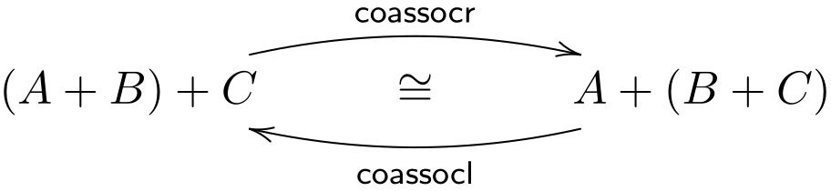
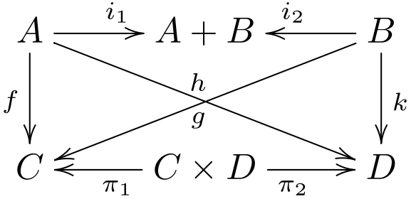
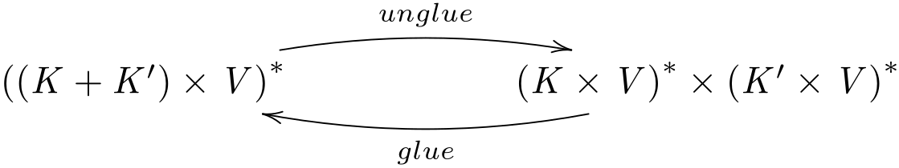
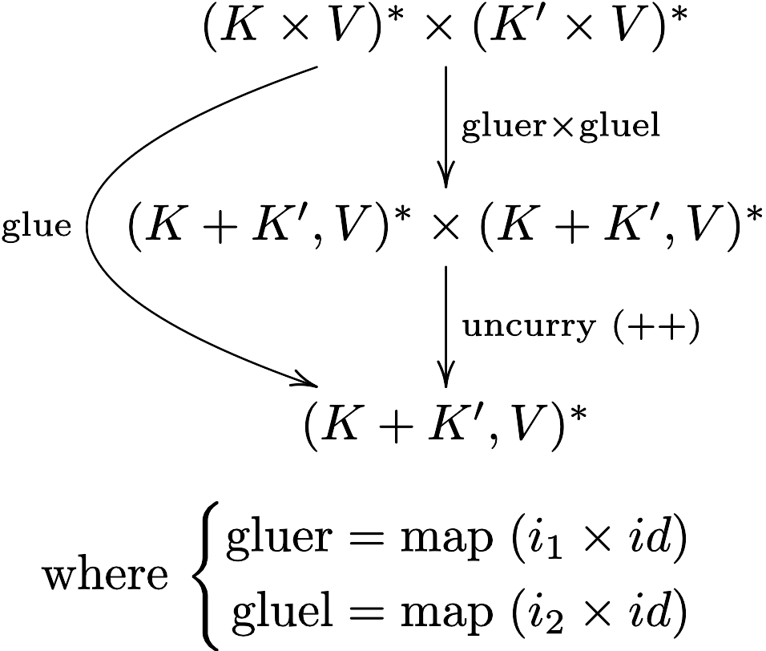
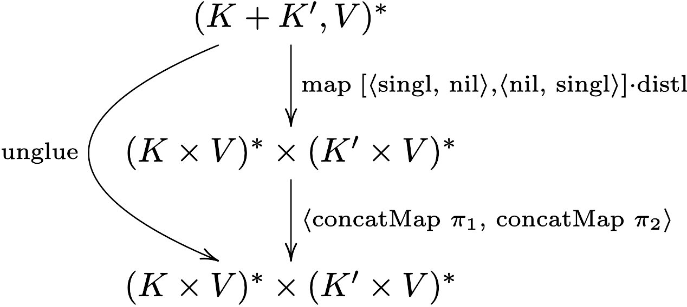

# CP - Ficha 4

## Exercício 1

> Considere o isomorfismo
>
> <div align="center">
>   
> </div>
>
> onde $\text{coassocr} = [id + i_1, i_2 \cdot i_2]$.
Calcule a sua conversa resolvendo em ordem a $\text{coassocl}$
a equação,
>
> $$\text{coassocl} \cdot \text{coassocr} = id$$
>
> isto é, a equação
>
> $$\text{coassocl} \cdot [id + i_1, i_2 \cdot i_2] = id$$
>
> Finalmente, exprima $\text{coassocl}$ sob a forma de um programa em Haskell
*não recorra* ao combinador `either` e teste as duas versões no GHCi.

<div style="page-break-after: always;"></div>

### Resolução 1

$$
\begin{align*}
&\text{coassocl} \cdot [id + i_1, i_2 \cdot i_2] = id \\
&\equiv \tag{\small{20: Fusão-+}} \\
&[\text{coassocl} \cdot (id + i_1), \text{coassocl} \cdot (i_2 \cdot i_2)] = id \\
&\equiv \tag{\small{17: Universal-+, 1: Natural-id}} \\
&\left\{
\begin{aligned}
&\text{coassocl} \cdot (id + i_1) = i_1 \\
&\text{coassocl} \cdot i_2 \cdot i_2 = i_2
\end{aligned}
\right. \\
&\equiv \tag{\small{21: Def-+, 1: Natural-id}} \\
&\left\{
\begin{aligned}
&\text{coassocl} \cdot [i_1, i_2 \cdot i_1] = i_1 \\
&\text{coassocl} \cdot i_2 \cdot i_2 = i_2
\end{aligned}
\right. \\
&\equiv \tag{\small{20: Fusão-+}} \\
&\left\{
\begin{aligned}
&[\text{coassocl} \cdot i_1, \text{coassocl} \cdot i_2 \cdot i_1] = i_1 \\
&\text{coassocl} \cdot i_2 \cdot i_2 = i_2
\end{aligned}
\right. \\
&\equiv \tag{\small{17: Universal-+}} \\
&\left\{
\begin{aligned}
&\text{coassocl} \cdot i_1 = i_1 \cdot i_1 \\
&\text{coassocl} \cdot i_2 \cdot i_1 = i_1 \cdot i_2 \\
&\text{coassocl} \cdot i_2 \cdot i_2 = i_2
\end{aligned}
\right. \\
&\equiv \tag{\small{17: Universal-+}} \\
&\left\{
\begin{aligned}
&\text{coassocl} \cdot i_1 = i_1 \cdot i_1 \\
&\text{coassocl} \cdot i_2 = [i_1 \cdot i_2, i_2]
\end{aligned}
\right. \\
&\equiv \tag{\small{17: Universal-+}} \\
&\text{coassocl} = [i_1 \cdot i_1, [i_1 \cdot i_2, i_2]] \\
&\equiv \tag{\small{21: Def-+, 1: Natural-id}} \\
&\text{coassocl} = [i_1 \cdot i_1, i_2 + id] \\
\\[1em]
\end{align*}
$$

$$
\begin{align*}
&\left\{
\begin{aligned}
&\text{coassocl} \cdot i_1 = i_1 \cdot i_1 \\
&\text{coassocl} \cdot i_2 \cdot i_1 = i_1 \cdot i_2 \\
&\text{coassocl} \cdot i_2 \cdot i_2 = i_2
\end{aligned}
\right. \\
\end{align*}
$$

```haskell
coassocl :: Either a (Either b c) -> Either (Either a b) c
coassocl (Left x) = Left (Left x)
coassocl (Right (Left x)) = Left (Right x)
coassocl (Right (Right x)) = Right x
```

<div style="page-break-after: always;"></div>

## Exercício 2

> Considere a seguinte declaração de um tipo de *árvores binárias*, em Haskell:
>
> ```haskell
> data LTree a = Leaf a | Fork (LTree a, LTree a)
> ```
>
> Indagando os tipos dos construtores $Leaf$ e $Fork$, por exemplo no GHCi,
>
> ```haskell
> *LTree> :t Fork
> Fork :: (LTree a, LTree a) -> LTree a
> *LTree> :t Leaf
> Leaf :: a -> LTree a
> ```
>
> faz sentido definir a função que mostra como construir árvores deste tipo:
>
> $$\text{in} = [Leaf, Fork] \tag{F1}$$
>
> Desenhe um diagrama para esta função e calcule a sua inversa
>
> $$
> \begin{align*}
> &\text{out} \; (Leaf \; a) = i_1 \; a \\
> &\text{out} \; (Fork \; (x, y)) = i_2 \; (x, y)
> \end{align*}
> $$
>
> de novo resolvendo a equação $\text{out} \cdot \text{in} = id$ em ordem a $\text{out}$,
agora para o $\text{(F1)}$. \
> Finalmente, faça testes em Haskell que involvam a composição
$\text{in} \cdot \text{out}$ e tire conclusões.

### Resolução 2

$$
\begin{align*}
&\text{out} \cdot \text{in} = id \\
&\equiv \tag{\small{F1: Def. in}} \\
&\text{out} \cdot [Leaf, Fork] = id \\
&\equiv \tag{\small{20: Fusão-+}} \\
&[\text{out} \cdot Leaf, \text{out} \cdot Fork] = id \\
&\equiv \tag{\small{17: Universal-+, 1: Natural-id}} \\
&\left\{
\begin{aligned}
&\text{out} \cdot Leaf = i_1 \\
&\text{out} \cdot Fork = i_2
\end{aligned}
\right. \\
&\equiv \tag{\small{72: Ig. Ext., 73: Def-comp}} \\
&\left\{
\begin{aligned}
&\text{out} \; (Leaf \; a) = i_1 \; a \\
&\text{out} \; (Fork \; (x,y)) = i_2 \; (x,y) \\
\end{aligned}
\right. \\
\end{align*}
$$

<div style="page-break-after: always;"></div>

## Exercício 3

> Deduza o tipo mais geral da função
$\alpha = (id + \pi_1) \cdot i_2 \cdot \pi_2$
e represente-o num diagrama.

### Resolução 3

$$
\begin{array}{}
C + B \xleftarrow{\quad id \; + \; \pi_1 \quad}
C + (B \times D) \xleftarrow{\quad i_2 \quad}
B \times D \xleftarrow{\quad \pi_2 \quad}
A \times (B \times D)
\end{array}
$$

$$
\alpha : A \times (B \times D) \to C + B
$$

## Exercício 4

> Considere a função
>
> $$\alpha = \text{swap} \cdot (id \times \text{swap}) \tag{F2}$$
>
> Calcule o tipo mais geral de $\alpha$ e formule a sua
propriedade natural (grátis) a inferir através de
um diagrama, como se explicou na aula teórica.

### Resolução 4

$$
\begin{align*}
\text{swap}             &: A \times B \to B \times A \\
(id \times \text{swap}) &: A \times (B \times C) \to A \times (C \times B) \\
\alpha                  &: A \times (B \times C) \to (C \times B) \times A \\
\end{align*}
\\[2em]
\begin{array}{ccc}
(A \times B) \times C & \xrightarrow{\qquad\alpha\qquad} & (C \times B) \times A \\
\Big\vert & & \Big\vert \\
f \times (g \times h) & & (h \times g) \times f \\
\Big\downarrow & & \Big\downarrow \\
A' \times (B' \times C') & \xrightarrow{\qquad\alpha\qquad} & (C' \times B') \times A' \\
\end{array}
\\[1em]
\alpha \cdot (f \times (g \times h)) = ((h \times g) \times f) \cdot \alpha
$$

<div style="page-break-after: always;"></div>

## Exercício 5

> Considere as funções elementares que respetivamente juntam ou duplicam informação:
>
> $$
> \begin{align*}
> join = [id, id] \tag {F3} \\
> dup = \langle id, id \rangle \tag {F4}
> \end{align*}
> $$
>
> Calcule (justificando) a propriedade grátis da função
$\alpha = dup \cdot join$ e indique por que razão
não pode calcular essa propriedade para $join \cdot dup$.

### Resolução 5

$$
\begin{align*}
&join : A + A \to A \\
&dup  : B \to B \times B \\
\end{align*}
\\[1em]
\begin{align*}
&\text{Para a composição ser possível, } B = A \text{, logo:} \\
&dup : A \to A \times A \\
&dup \cdot join : A + A \to A \times A \\
\end{align*}
\\[1em]
\text{Propriedade grátis de } \alpha = dup \cdot join
\\[1em]
\begin{array}{ccc}
A + A & \xrightarrow{\qquad\alpha\qquad} & A \times A \\
\Big\vert & & \Big\vert \\
f + f & & f \times f \\
\Big\downarrow & & \Big\downarrow \\
A' + A' & \xrightarrow{\qquad\alpha\qquad} & A' \times A' \\
\end{array}
\\[1em]
\alpha \cdot (f + f) = (f \times f) \cdot \alpha
\\[2em]
\text{Não podemos calcular a propriedade natural para } join \cdot dup \\
\text{pois o codomínio de } join \text{ é incompátivel com o domínio de } dup.
$$

<div style="page-break-after: always;"></div>

## Exercício 6

> Seja dada uma função $\nabla$ da qual só sabe duas
propriedades: $\nabla \cdot i_1 = id$ e $\nabla \cdot i_2 = id$.
Mostre que, necessariamente, $\nabla$ satisfaz também a
propriedade natural
>
> $$f \cdot \nabla = \nabla \cdot (f + f) \tag{F5}$$

### Resolução 6

$$
\begin{align*}
&\left\{
\begin{aligned}
&\nabla \cdot i_1 = id \\
&\nabla \cdot i_2 = id
\end{aligned}
\right.
\end{align*}
\quad \equiv \quad
\nabla = [id, id]
\tag{\small{17: Universal-+}}
$$

$$
\begin{align*}
&f \cdot \nabla = \nabla \cdot (f + f) \\
&\equiv \tag{\small{Def. ∇}} \\
&f \cdot \nabla = [id, id] \cdot (f + f) \\
&\equiv \tag{\small{22: Absorção-+}} \\
&f \cdot \nabla = [id \cdot f, id \cdot f] \\
&\equiv \tag{\small{1: Natural-id}} \\
&f \cdot \nabla = [f \cdot id, f \cdot id] \\
&\equiv \tag{\small{20: Fusão-+}} \\
&f \cdot \nabla = f \cdot [id, id] \\
&\equiv \tag{\small{Def. ∇}} \\
&f \cdot \nabla = f \cdot \nabla \qquad \text{c.q.m.}
\end{align*}
$$

<div style="page-break-after: always;"></div>

## Exercício 7

> Seja dada uma função $\alpha$ cuja propriedade grátis é:
>
> $$(f + h) \cdot \alpha = \alpha \cdot (f + g \times h) \tag{F6}$$
>
> Será esta propriedade suficiente para deduzir a definição de $\alpha$?
Justifique analiticamente.

### Resolução 7

$$
(f + h) \cdot \alpha = \alpha \cdot (f + g \times h)
\\[1em]
\begin{array}{ccc}
A + (B \times C) & \xrightarrow{\qquad\alpha\qquad} & A + C \\
\Big\vert & & \Big\vert \\
f + g \times h & & f + h \\
\Big\downarrow & & \Big\downarrow \\
A' + (B' \times C') & \xrightarrow{\qquad\alpha\qquad} & A' + C' \\
\end{array}
\\[2em]
\alpha : A + (B \times C) \to A + C \\
\text{Deduz-se que: } \alpha = id + \pi_2
\\[1em]
\text{Prova analítica:}
\\[0.5em]
$$

$$
\begin{align*}
&(f + h) \cdot \alpha = \alpha \cdot (f + g \times h) \\
&\equiv \tag{\small{Dedução da def. α}} \\
&(f + h) \cdot (id + \pi_2) = (id + \pi_2) \cdot (f + g \times h) \\
&\equiv \tag{\small{25: Functor-+}} \\
&(f \cdot id) + (h \cdot \pi_2) = (id \cdot f) + (\pi_2 \cdot (g \times h)) \\
&\equiv \tag{\small{1: Natural-id, 13: Natural-$\pi_2$}} \\
&f + (h \cdot \pi_2) = f + (h \cdot \pi_2) \qquad \text{c.q.d.}
\end{align*}
$$

<div style="page-break-after: always;"></div>

## Exercício 8

> O [formulário](https://haslab.github.io/CP/Material/cpCalFun.pdf)
inclui as duas equivalências seguintes, válidas para qualquer isomorfismo $\alpha$:
>
> $$
> \begin{align*}
> \alpha \cdot g = h \equiv g = \alpha^{\circ} \cdot h \tag{F7} \\
> g \cdot \alpha = h \equiv g = h \cdot \alpha^{\circ} \tag{F8}
> \end{align*}
> $$
>
> Recorra a essas propriedades para mostrar que a igualdade
>
> $$h \cdot \text{distr} \cdot (g \times (id + \alpha)) = k$$
>
> é equivalente à igualdade
>
> $$h \cdot (g \times id + g \times \alpha) = k \cdot \text{undistr}$$
>
> (**Sugestão**: não ignore a propriedade natural (i.e. grátis) do isomorfismo $\text{distr}$.)

### Resolução 8

$$
\text{distr}^{\circ} = \text{undistr}
\\[0.5em]
\text{distr} : A \times (B + C) \to (A \times B) + (A \times C)
\\[1em]
\begin{array}{ccc}
A \times (B + C) & \xrightarrow{\qquad\text{distr}\qquad} & (A \times B) + (A \times C) \\
\Big\vert & & \Big\vert \\
f \times (g + h) & & (f \times g) + (f \times h) \\
\Big\downarrow & & \Big\downarrow \\
A' \times (B' + C') & \xrightarrow{\qquad\text{distr}\qquad} & (A' \times B') + (A' \times C') \\
\end{array}
\\[1em]
\text{Propriedade natural de } \text{distr: } \\[0.5em]
((f \times g) + (f \times h)) \cdot \text{distr} = \text{distr} \cdot (f \times (g + h))
\\[2em]
$$

$$
\begin{align*}
&h \cdot \text{distr} \cdot (g \times (id + \alpha)) = k \\
&\equiv \tag{\small{Prop. grátis de distr}} \\
&h \cdot ((g \times id) + (g \times \alpha)) \cdot \text{distr} = k \\
&\equiv \tag{\small{F8 [a.k.a.] 33: Shunt-left}} \\
&h \cdot ((g \times id) + (g \times \alpha)) = k \cdot \text{undistr}
\\[0.5em]
&\text{c.q.m.}
\end{align*}
$$

<div style="page-break-after: always;"></div>

## Exercício 9

> A *lei da troca* (identifique-a no [formulário](https://haslab.github.io/CP/Material/cpCalFun.pdf))
permite-nos exprimir determinadas funções sob duas formas alternativas,
conforme desenhado no respectivo diagrama:
>
> $$[\langle f, g \rangle, \langle h, k \rangle] = \langle [f, h], [g, k] \rangle \tag{F9}$$
>
> <div align="center">
>   
> </div>
>
> Demonstre esta lei recorrendo às propriedades (e.g. universais) dos produtos e dos coprodutos.

### Resolução 9

$$
\begin{align*}
&[\langle f, g \rangle, \langle h, k \rangle] = \langle [f, h], [g, k] \rangle \\
&= \tag{\small{6: Universal-$\times$}} \\
&\left\{
\begin{aligned}
&[f, h] = \pi_1 \cdot [\langle f, g \rangle, \langle h, k \rangle] \\
&[g, k] = \pi_2 \cdot [\langle f, g \rangle, \langle h, k \rangle]
\end{aligned}
\right. \\
&= \tag{\small{20: Fusão-+, 7: Cancelamento-$\times$}} \\
&\left\{
\begin{aligned}
&[f, h] = [f, h] \\
&[g, k] = [g, k]
\end{aligned}
\right. \quad \text{c.q.d.}
\end{align*}
$$

<div style="page-break-after: always;"></div>

## Exercício 10

> **Questão prática**
> ***Problem requirements:***
>
> *Well-known services such as Google Maps, Google Analytics, YouTube, MapReduce etc.
run on top of [Bigtable](https://en.wikipedia.org/wiki/Bigtable) or successors thereof.
Such data systems rely on the so-called [key-value](https://en.wikipedia.org/wiki/Key%E2%80%93value_database)
NoSQL data model, which is widely adopted because of its efficiency and flexibility.*
>
> *Key-value stores can be regarded abstractly as lists of pairs $(K \times V)^*$
in which $K$ is a datatype of* keys *and $V$ is a type of data* values.
*Keys uniquely identify values. Key-value stores with the same type $V$
of values can be glued together as the diagram suggests,*
>
> <div align="center">
>   
> </div>
>
> *where $unglue$ performs the action opposite to $glue$.*
>
> *Define $glue$ and $unglue$ in Haskell structured along the functional combinators
($f \cdot g$, $\langle f, g \rangle$, $f \times g$, and so on) studied in this course
and available from library [Cp.hs](https://haslab.github.io/CP/Material/).
Use **diagrams** to plan your solutions, in which you should avoid re-inventing functions over
lists already available from the Haskell [standard libraries](https://hackage.haskell.org/).*

<div style="page-break-after: always;"></div>

### Resolução 10

```haskell
import Cp (split, p1, p2, i1, i2, (><), singl, nil, distl)

glue :: ([(k, v)], [(k, v)]) -> [(Either k k, v)]
glue = uncurry (++) . (gluer >< gluel)
  where
    gluer = map (i1 >< id)
    gluel = map (i2 >< id)

unglue :: [(Either k k, v)] -> ([(k, v)], [(k, v)])
unglue = split (concatMap p1) (concatMap p2)
         . map (either (split singl nil) (split nil singl) . distl)

-- test
glued = ([(1, "one"), (3, "three")], [(2, "two"), (4, "four")])
unglued = [(Left 1, "one"), (Left 3, "three"), (Right 2, "two"), (Right 4, "four")]
test = print $ unglue unglued == glued && glue glued == unglued
```

<div align="center">
    
    <br/>
    <i>Diagrama da função glue</i>
</div>

<br/>

<div align="center">
    
    <br/>
    <i>Diagrama da função unglue</i>
</div>

$\square$
