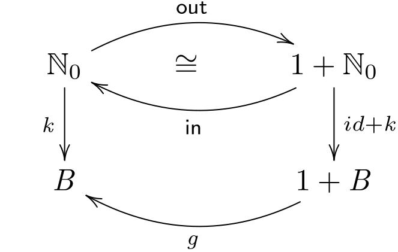

# CP - Ficha 6

## Exercício 1

> O código que se segue, escrito em Haskell, implementa a noção de ciclo-for,
onde $b$ é o corpo (“body”) do ciclo e $i$ é a sua inicialização:
>
>
> $$
> \left\{
> \begin{aligned}
> &\text{for} \; b \; i \; 0 = i \\
> &\text{for} \; b \; i \; (n + 1) = b \; (\text{for} \; b \; i \; n)
> \end{aligned}
> \right.
> \tag{F1}
> $$
>
> Mostre que
>
> $$
> \text{for} \; b \; i = \lb g \rb \tag{F2}
> $$
>
> se verifica, para um dado $g$ (descubra qual).
> Sugestão: recorra à lei universal
>
> $$
> k = \lb g \rb \Leftrightarrow k \cdot \text{in} = g \cdot (id + k)
> $$
>
> abordada na aula teórica, onde
>
> $$
> \left\{
> \begin{aligned}
> &\text{in} = [\text{zero} , \text{succ}] \\
> &\text{zero} \; \_ = 0 \\
> &\text{succ} \; n = n + 1
> \end{aligned}
> \right.
> \tag{F3}
> $$
>
> <div align="center">
>   
> </div>

<div style="page-break-after: always;"></div>

### Resolução 1

$$
\begin{align*}
&\text{Let } \lb g \rb = \lb [g_1, g_2] \rb \\[1em]
&\text{for } b \; i = \lb [g_1, g_2] \rb \\
&\equiv \tag{\small{46: Universal-cata}} \\
&(\text{for } b \; i) \cdot \text{in} = [g_1, g_2] \cdot (id + (\text{for } b \; i)) \\
&\equiv \tag{\small{Def. in, 22: Absorção-+, 1: Natural-id}} \\
&(\text{for } b \; i) \cdot [\underline{0}, \text{succ}] = [g_1, g_2 \cdot (\text{for } b \; i)] \\
&\equiv \tag{\small{20: Fusão-+}} \\
&[(\text{for } b \; i) \cdot \underline{0}, (\text{for } b \; i) \cdot \text{succ}] = [g_1, g_2 \cdot (\text{for } b \; i)] \\
&\equiv \tag{\small{27:Eq-+, 4: Absorção-const}} \\
&\left\{
\begin{aligned}
&\underline{\text{for } b \; i \; 0} = g_1 \\
&(\text{for } b \; i) \cdot \text{succ} = g_2 \cdot (\text{for } b \; i)
\end{aligned}
\right. \\
&\equiv \tag{\small{72: Ig. Ext., 73: Def-comp, Def. succ, 75: Def-const}} \\
&\left\{
\begin{aligned}
&\text{for } b \; i \; 0 = g_1 \; x \\
&\text{for } b \; i \; (n + 1) = g_2 \; (\text{for } b \; i \; n)
\end{aligned}
\right. \\
&\Rightarrow \\
&\left\{
\begin{aligned}
&g_1 = \underline{i} \\
&g_2 = b
\end{aligned}
\right. \\[1em]
&\text{Logo:} \quad \text{for } b \; i = \lb [\underline{i}, b] \rb
\end{align*}
$$

<div style="page-break-after: always;"></div>

## Exercício 2

> Na sequência da questão anterior, codifique
>
> $$f = \pi_2 \cdot aux \quad \textbf{where } aux = \text{for} \; \langle \text{succ} \cdot \pi_1, \text{mul} \rangle \; (1, 1) \tag{F4}$$
>
> em Haskell e inspecione o seu comportamento.
> Que função $f$ é essa?

### Resolução 2

$$
\text{Pelo exercício anterior, temos:} \\[0.5em]
aux = \lb [\underline{(1,1)}, \langle \text{succ} \cdot \pi_1, \text{mul} \rangle] \rb \\[1em]
[\underline{(1,1)}, \langle \text{succ} \cdot \pi_1, \text{mul} \rangle] : 1 + \mathbb{N_0} \times \mathbb{N_0} \to \mathbb{N_0} \times \mathbb{N_0} \\
$$

```
aux 0 = (1, 1)
aux 1 = (2, 1)
aux 2 = (3, 2)
aux 3 = (4, 6)
aux 4 = (5, 24)
aux 5 = (6, 120)
```

```haskell
aux 0 = (1, 1)
aux (n + 1) = (pi_1 (aux n) + 1, mul (aux n))
```

$$
\text{A função } f \; n \text{ é o factorial de } n.
$$

<div style="page-break-after: always;"></div>

## Exercício 3

> Mostre que $(a+)$ dada a seguir é um ciclo-for $b \; i$ (F1) para um dado $b$ e um dado $i$ — descubra quais:
>
> $$
> \left\{
> \begin{aligned}
> &a + 0 = a \\
> &a + (n + 1) = 1 + (a + n)
> \end{aligned}
> \right.
> \tag{F5}
> $$

### Resolução 3


$$
\begin{align*}
&\left\{
\begin{aligned}
&a + 0 = a \\
&a + (n + 1) = 1 + (a + n)
\end{aligned}
\right. \\
&\equiv \tag{\small{72: Ig. Ext., 75: Def-const, Def. succ}} \\
&\left\{
\begin{aligned}
&(a +) \; (\underline{0} \; n) = \underline{a} \; n \\
&(a +) \; (\text{succ} \; n) = \text{succ} \; ((a +) \; n)
\end{aligned}
\right. \\
&\equiv \tag{\small{74: Def-comp, 72: Ig. Ext.}} \\
&\left\{
\begin{aligned}
&(a +) \cdot \underline{0} = \underline{a} \\
&(a +) \cdot \text{succ} = \text{succ} \cdot (a +)
\end{aligned}
\right. \\
&\equiv \tag{\small{27: Eq-+}} \\
&[(a +) \cdot \underline{0}, (a +) \cdot \text{succ}] = [\underline{a}, \text{succ} \cdot (a +)] \\
&\equiv \tag{\small{20: Fusão-+, 1: Natural-id, 22: Absorção-+}} \\
&(a +) \cdot [\underline{0}, \text{succ}] = [\underline{a}, \text{succ}] \cdot (id + (a +)) \\
&\equiv \tag{\small{46: Universal-cata}} \\
&(a +) = \lb [\underline{a}, \text{succ}] \rb \\
&\equiv \tag{\small{F2}} \\
&(a +) = \text{for} \; \text{succ} \; a
\end{align*}
$$

<div style="page-break-after: always;"></div>

## Exercício 4

> Recorde a lei de “fusão-cata”:
>
> $$
> f \cdot \lb g \rb = \lb h \rb \Leftarrow f \cdot g = h \cdot (id + f)
> \tag{F6}
> $$
>
> deduzida na aula teórica. Recorra a (F6) para demonstrar a propriedade:
>
> $$f \cdot (\text{for} \; f \; i) = \text{for} \; f \; (f \; i)$$
>
> sabendo que $\text{for} \; f \; i = \lb [\underline{i}, f] \rb$.

### Resolução 4

$$
\begin{align*}
&f \cdot (\text{for} \; f \; i) = \text{for} \; f \; (f \; i) \\
&\equiv \tag{\small{F2}} \\
&f \cdot \lb [\underline{i}, f] \rb = \lb [\underline{f \; i}, f] \rb \\
&\Leftarrow \tag{\small{49: Fusão-cata (F6)}} \\
&f \cdot [\underline{i}, f] = [\underline{f \; i}, f] \cdot (id + f) \\
&\equiv \tag{\small{20: Fusão-+, 22: Absorção-+}} \\
&[f \cdot \underline{i}, f \cdot f] = [\underline{f \; i} \cdot id, f \cdot f] \\
&\equiv \tag{\small{4: Absorção-const, 1: Natural-id}} \\
&[\underline{f \; i}, f \cdot f] = [\underline{f \; i}, f \cdot f] \\
\end{align*}
$$

<div style="page-break-after: always;"></div>

## Exercício 5

> Mostre que as funções:
>
> $$
> \begin{align*}
> &f = \text{for} \; id \; i \\
> &g = \text{for} \; \underline{i} \; i
> \end{align*}
> $$
>
> são a mesma função. (Qual?)

### Resolução 5

$$
\begin{align*}
&g = \text{for} \; \underline{i} \; i \\
&\equiv \tag{\small{F2}} \\
&g = \lb [\underline{i}, \underline{i}] \rb \\
&\equiv \tag{\small{46: Universal-cata}} \\
&g \cdot \text{in} = [\underline{i}, \underline{i}] \cdot (id + g) \\
&\equiv \tag{\small{Isomorfismo in/out, 33: Shunt-left}} \\
&g = [\underline{i}, \underline{i}] \cdot (id + g) \cdot \text{out} \\
&\equiv \tag{\small{1: Natural-id, 20: Fusão-+}} \\
&g = \underline{i} \cdot [id, id] \cdot (id + g) \cdot \text{out} \\
&\equiv \tag{\small{3: Fusão-const}} \\
&g = \underline{i} \\
\\[1em]
&\underline{i} = \text{for} \; id \; i \\
&\equiv \tag{\small{F2}} \\
&\underline{i} = \lb [\underline{i}, id] \rb \\
&\equiv \tag{\small{46: Universal-cata}} \\
&\underline{i} \cdot \text{in} = [\underline{i}, id] \cdot (id + \underline{i}) \\
&\equiv \tag{\small{3: Fusão-const, 2w: Absorção-+}} \\
&\underline{i} = [\underline{i}, \underline{i}] \\
&\equiv \tag{\small{1: Natural-id, 20: Fusão-+, 3: Fusão-const}} \\
&\underline{i} = \underline{i} \\
\end{align*}
$$

<div style="page-break-after: always;"></div>

## Exercício 6

> Considere o catamorfismo $rep \; f = \lb [id, (f \cdot)] \rb$.
Comece por fazer um diagrama do catamorfismo e responda:
>
> Qual é o tipo de $rep$? O que faz $rep$?
>
> Usando o combinador `cataNat g` da biblioteca `Nat.hs` para implementar
$\lb g \rb$, avalie no GHCi expressões como, por exemplo `rep (2*) 0 3` e `rep ("a"++) 10 "b"`
e veja se os resultados confirmam as suas respostas acima.

### Resolução 6

**TODO**

<div style="page-break-after: always;"></div>

## Exercício 7

> Qualquer função $k = \text{for} \; f \; i$ pode ser codificada em sintaxe C escrevendo:
>
> ```c
> int k(int n) {
>   int r = i;
>   int j;
>   for (j = 1; j < n + 1; j++) { r = f(r); }
>   return r;
> }
> ```
>
> Escreva em sintaxe C as funções $(a*) = \text{for} \; (a+) \; 0$ e outros catamorfismos de naturais de que se tenha falado nas aulas da UC.

### Resolução 7

**TODO**

<div style="page-break-after: always;"></div>

## Exercício 8

> **Questão prática**
>
> ***Problem requirements**: The following function:*
>
> ```haskell
> func :: Eq a => b -> [(a, b)] -> (a -> b)
> func b = (maybe b id .) . flip lookup
> ```
>
> “functionalizes” *a finite list of (key, value) pairs by converting it to a function from keys to values.
The first parameter provides a default value for keys that cannot be found in the list.*
>
> *As example, let us have a list of people (where the key is some numeric id):*
>
> ```haskell
> a = [(140999000,"Manuel"), (200100300,"Mary"), (000111222,"Teresa")]
> ```
>
> *their nationalities (if known):*
>
> ```haskell
> b = [(140999000,"PT"), (200100300,"UK")]
> ```
>
> *and places of residence (if known):*
>
> ```haskell
> c = [(140999000,"Braga"), (200100300,"Porto"), (151999000,"Lisbon")]
> ```
>
> *Using only $func$, $\langle f , g \rangle$, $\pi_1$, $\pi_2$, $map$ and $nub$,
write a Haskell expression representing the following data aggregation:*
>
> Id        | Name      | Country | Residence
> ----------|-----------|---------|-----------
> 140999000 | Manuel    |PT       | Braga
> 200100300 | Mary      |UK       | Porto
> 000111222 | Teresa    |?        | -
> 151999000 | (Unknown) |?        | Lisbon

<div style="page-break-after: always;"></div>

### Resolução 8

**TODO**

$\square$
