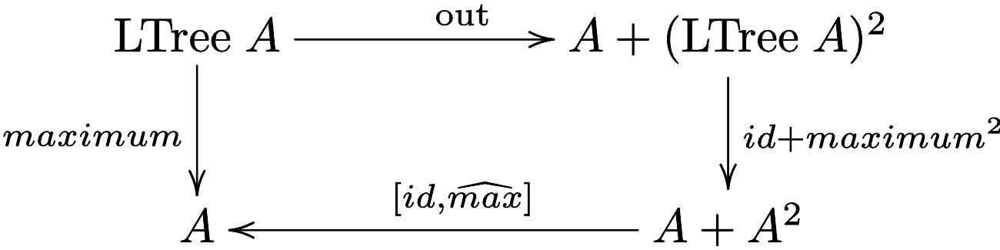

# CP - Ficha 9

## Exercício 1

> Considere o seguinte inventário de quatro tipos de árvores:
> $$
> \begin{align*}
>    &\text{a) Árvores com informação de tipo } A \text{ nas folhas:} \\
>    &\hspace{2cm} \text{T} = \text{LTree} \; A
>    \hspace{4.1em}
>    \begin{cases}
>        \text{F} \; X = A + X^2 \\
>        \text{F} \; f = id + f^2
>    \end{cases}
>    \hspace{6.25em} \text{in} = [\text{Leaf} , \text{Fork}] \\
>    &\text{Haskell:} \quad \texttt{data LTree a = Leaf a | Fork (LTree a, LTree a)} \\[1.2em]
>    &\text{b) Árvores com informação de tipo } A \text{ nos nós:} \\
>    &\hspace{2cm} \text{T} = \text{BTree} \; A
>    \hspace{4.1em}
>    \begin{cases}
>        \text{F} \; X = 1 + A \times X^2 \\
>        \text{F} \; f = id + id \times f^2
>    \end{cases}
>    \hspace{4.45em} \text{in} = [\underline{\text{Empty}}, \text{Node}] \\
>    &\text{Haskell:} \quad \texttt{data BTree a = Empty | Node (a, (BTree a, BTree a))} \\[1.2em]
>    &\text{c) Árvores com informação nos nós e nas folhas:} \\
>    &\hspace{2cm} \text{T} = \text{FTree} \; B \; A
>    \hspace{3.1em}
>    \begin{cases}
>        \text{F} \; X = B + A \times X^2 \\
>        \text{F} \; f = id + id \times f^2
>    \end{cases}
>    \hspace{4.1em} \text{in} = [\text{Unit} , \text{Comp}] \\
>    &\text{Haskell:} \quad \texttt{data FTree b a = Unit b | Comp (a, (FTree b a, FTree b a))} \\[1.2em]
>    &\text{d) Árvores de expressão:} \\
>    &\hspace{2cm} \text{T} = \text{Expr} \; V \; O
>    \hspace{3.6em}
>    \begin{cases}
>        \text{F} \; X = V + O \times X^* \\
>        \text{F} \; f = id + id \times \text{map} \; f
>    \end{cases}
>    \hspace{2.7em} \text{in} = [\text{Var} , \text{Term}] \\
>    &\text{Haskell:} \quad \texttt{data Expr v o = Var v | Term (o, [Expr v o])} \\[1.2em]
>\end{align*}
>$$
> Defina o gene $g$ para cada um dos catamorfismos seguintes desenhando,
para cada caso, o diagrama correspondente:
> - $maximum = \lb g \rb$ — devolve a maior folha de uma árvore de tipo a).
> - $inorder = \lb g \rb$ — faz a travessia inorder de uma árvore de tipo b).
> - $mirror = \lb g \rb$ — espelha uma árvore de tipo b), i.e., roda-a de $180^\circ$.
> - $rep \; a = \lb g \rb$ — substitui todas as folhas de uma árvore de tipo a) por um mesmo valor $a \in A$.
> - $convert = \lb g \rb$ — converte árvores de tipo c) em árvores de tipo b) eliminando os $B$s que estão na primeira.
> - $vars = \lb g \rb$ — lista as variáveis de uma árvore expressão de tipo d).

### Resolução 1

$$\large{maximum}$$

<div align="center">
    
</div>

$$\\[2em]\large{inorder}$$

<div align="center">
    
</div>

$$\\[2em]\large{mirror}$$

<div align="center">
    
</div>

$$\\[2em]\large{rep \; a}$$

<div align="center">
    
</div>

<div style="page-break-after: always;"></div>

$$\\[2em]\large{convert}$$

<div align="center">
    
</div>

$$\\[2em]\large{vars}$$

<div align="center">
    
</div>

<div style="page-break-after: always;"></div>

## Exercício 2

> Derive a versão *pointwise* do seguinte catamorfismo de $\text{BTree}$s,
>
> $$
> \begin{align*}
> &\text{tar} = \lb [\text{singl} \cdot \text{nil}, g] \rb \; \textbf{where} \\
> &\quad g = \text{map} \; \text{cons} \cdot lstr \cdot (id \times \text{conc}) \\
> &\quad \text{lstr} \; (b, x) = [(b, a) \mid a \leftarrow x]
> \end{align*}
> $$
>
> entregando no final uma versão da função em que não ocorrem os nomes das funções
$\text{map}$, $\text{cons}$, $\text{singl}$, $\text{nil}$, $\text{conc}$ e $lstr$.
Pode usar $\text{map} \; f \; x = [f \; a \mid a \leftarrow x]$
como definição *pointwise* de $\text{map}$ em listas.

### Resolução 2

$$
\begin{align*}
&\text{tar} = \lb [\text{singl} \cdot \text{nil}, g] \rb \\
&\equiv \tag{\small{46: Universal-cata, Def. Functor BTree}} \\
&\text{tar} \cdot \text{in}_\text{BTree} = [\text{singl} \cdot \text{nil}, g] \cdot (id + id \times \text{tar}^2) \\
&\equiv \tag{\small{Def $\text{in}_\text{BTree}$, 20: Fusão-+, 22: Absorção-+, 1: Natural-id}} \\
&[\text{tar} \cdot \text{Empty}, \text{tar} \cdot \text{Node}] = [\text{singl} \cdot \text{nil}, g \cdot (id \times \text{tar}^2)] \\
&\equiv \tag{\small{27: Eq-+, Def. g}} \\
&\begin{cases}
\text{tar} \cdot \underline{\text{Empty}} = \text{singl} \cdot \text{nil} \\
\text{tar} \cdot \text{Node} = \text{map} \; \text{cons} \cdot \text{lstr} \cdot (id \times \text{conc}) \cdot (id \times \text{tar}^2)
\end{cases} \\
&\equiv \tag{\small{72, 73, 75, Def. nil, Def. singl}} \\
&\begin{cases}
\text{tar} \; \text{Empty} = \text{[[ ]]} \\
\text{tar} \; \text{Node} \; (b, (l,r)) = \text{map} \; \text{cons} \cdot \text{lstr} \cdot (id \times \text{conc}) \cdot (id \times \text{tar}^2) \; (b, (l,r))
\end{cases} \\
&\equiv \tag{\small{14: Functor-×, 1: Natural-id}} \\
&\begin{cases}
\text{tar} \; \text{Empty} = \text{[[ ]]} \\
\text{tar} \; \text{Node} \; (b, (l,r)) = \text{map} \; \text{cons} \cdot \text{lstr} \cdot (id \times \text{conc} \cdot (\text{tar} \times \text{tar})) \; (b, (l,r))
\end{cases} \\
&\equiv \tag{\small{78: Def-× (2×), 74: Def-id, 73: Def-comp}} \\
&\begin{cases}
\text{tar} \; \text{Empty} = \text{[[ ]]} \\
\text{tar} \; \text{Node} \; (b, (l,r)) = \text{map} \; \text{cons} \cdot \text{lstr} \; (b, \text{conc} \cdot (\text{tar} \; l, \text{tar} \; r))
\end{cases} \\
&\equiv \tag{\small{73: Def-comp, Def. lstr}} \\
&\begin{cases}
\text{tar} \; \text{Empty} = \text{[[ ]]} \\
\text{tar} \; \text{Node} \; (b, (l,r)) = \text{map} \; \text{cons} \; [(b, a) \mid a \leftarrow \text{conc} \cdot (\text{tar} \; l, \text{tar} \; r)]
\end{cases} \\
&\equiv \tag{\small{$\text{map} \; f \cdot g = \text{map} \; (f \cdot g)$, Def. cons}} \\
&\begin{cases}
\text{tar} \; \text{Empty} = \text{[[ ]]} \\
\text{tar} \; \text{Node} \; (b, (l,r)) = [\widehat{(:)} \; (b, a) \mid a \leftarrow \text{conc} \cdot (\text{tar} \; l, \text{tar} \; r)]
\end{cases}
\end{align*}
$$

<div style="page-break-after: always;"></div>

## Exercício 3

> Converta o catamorfismo $vars$ do exercício 1 numa função em Haskell
sem quaisquer combinadores *pointfree*.

### Resolução 3

$$
\begin{align*}
&\text{vars} = \lb [\text{singl}, \text{concat} \cdot \pi_2] \rb \\
&\equiv \tag{\small{46: Universal-cata, Def. Functor Expr}} \\
&\text{vars} \cdot \text{in}_\text{Expr} = [\text{singl}, \text{concat} \cdot \pi_2] \cdot (id + id \times \text{map} \; \text{vars}) \\
&\equiv \tag{\small{Def. $\text{in}_\text{Expr}$, 20: Fusão-+, 22: Absorção-+, 1: Natural-id}} \\
&[\text{vars} \cdot \text{Var}, \text{vars} \cdot \text{Term}] = [\text{singl}, \text{concat} \cdot \pi_2 \cdot (id \times \text{map} \; \text{vars})] \\
&\equiv \tag{\small{13: Natural-$\pi_2$, 27: Eq-+}} \\
&\begin{cases}
\text{vars} \cdot \text{Var} = \text{singl} \\
\text{vars} \cdot \text{Term} = \text{concat} \cdot \text{map} \; \text{vars} \cdot \pi_2
\end{cases} \\
&\equiv \tag{\small{72: Ig. Ext., 73: Def-comp, Def. singl}} \\
&\begin{cases}
\text{vars} \; (\text{Var} \; v) = [v] \\
\text{vars} \; (\text{Term} \; (o, exprs)) = \text{concat} \cdot \text{map} \; \text{vars} \cdot \pi_2 \; (o, exprs)
\end{cases} \\
&\equiv \tag{\small{79: Def-proj}} \\
&\begin{cases}
\text{vars} \; (\text{Var} \; v) = [v] \\
\text{vars} \; (\text{Term} \; (o, exprs)) = \text{concat} \cdot \text{map} \; \text{vars} \; exprs
\end{cases} \\
&\equiv \tag{\small{73: Def-comp, Def. map}} \\
&\begin{cases}
\text{vars} \; (\text{Var} \; v) = [v] \\
\text{vars} \; (\text{Term} \; (o, exprs)) = \text{concat} \; [\text{vars} \; e \mid e \leftarrow exprs]
\end{cases} \\
&\equiv \tag{\small{Def. concat}} \\
&\begin{cases}
\text{vars} \; (\text{Var} \; v) = [v] \\
\text{vars} \; (\text{Term} \; (o, exprs)) = \text{foldr} \; (++) \; [\;] \; [\text{vars} \; e \mid e \leftarrow exprs]
\end{cases} \\
&\equiv \tag{\small{$f \; (o, exprs) = \text{foldr} \; (++) \; [\;] \; [\text{vars} \; e \mid e \leftarrow exprs]$}} \\
&\begin{cases}
\text{vars} \; (\text{Var} \; v) = [v] \\
\text{vars} \; (\text{Term} \; (o, exprs)) = f \; (o, exprs) \\
\quad \textbf{ where } \\
\qquad f \; (\_, [\;]) = [\;] \\
\qquad f \; (o, \text{e:es}) = \text{vars} \; \text{e} \; \text{++} \; f \; (o, \text{es})
\end{cases} \\
\end{align*}
$$

<div style="page-break-after: always;"></div>

## Exercício 4

> Um *anamorfismo* é um *“catamorfismo ao contrário”*, i.e., uma função $k : A \to \text{T}$ tal que
>
> $$
> k = \text{in} \cdot \text{F} \; k \cdot g \tag{F1}
> $$
>
> escrevendo-se $k = \la g \ra$. Mostre que o anamorfismo de listas
>
> $$
> k = \la (id + \langle f , id \rangle) \cdot \text{out}_{\N_0} \ra \tag{F2}
> $$
>
> descrito pelo diagrama
>
> <div align="center">
>     
> </div>
>
> é a função
>
> $$
> \begin{cases}
> k \; 0 = [ \; ] \\
> k \; (n + 1) = (2 \; n + 1) : k \; n
> \end{cases}
> $$
>
> para $f \; n = 2 \; n + 1$. (Que faz esta função?)

<div style="page-break-after: always;"></div>

### Resolução 4

$$
\begin{align*}
&k = \la (id + \langle f , id \rangle) \cdot \text{out}_{\N_0} \ra \\
&\equiv \tag{\small{55: Universal-ana, Def. Functor $\N_0$}} \\
&\text{out}_{List} \cdot k = (id + id \times k) \cdot (id + \langle f , id \rangle) \cdot \text{out}_{\N_0} \\
&\equiv \tag{\small{34: Shunt-right, Iso. $\text{out}_{List}$, 33: Shunt-left, 25: Iso. $\text{out}_{\N_0}$}} \\
&k \cdot \text{in}_{\N_0} = \text{in}_{List} \cdot (id + id \times k) \cdot (id + \langle f , id \rangle) \\
&\equiv \tag{\small{Def. $\text{in}_{\N_0}$, Def, $\text{in}_{List}$}} \\
&k \cdot [\underline{0}, \text{succ}] = [\text{nil}, \text{cons}] \cdot (id + id \times k) \cdot (id + \langle f , id \rangle) \\
&\equiv \tag{\small{20: Fusão-+, 22: Absorção-+ (2×), 1: Natural-id (2×)}} \\
&[k \cdot \underline{0}, k \cdot \text{succ}] = [\text{nil}, \text{cons} \cdot (id \times k) \cdot \langle f, id \rangle] \\
&\equiv \tag{\small{27: Eq-+, 72: Ig. Ext., 73: Def-comp, 75: Def-const, Def. nil, Def. succ}} \\
&\begin{cases}
k \; 0 = [\;] \\
k \; (\text{succ} \; n) = \text{cons} \cdot (id \times k) \cdot \langle f, id \rangle \; n
\end{cases} \\
&\equiv \tag{\small{Def. succ, 73 (2×), 77: Def-split, 74 (2×), 78: Def-×, Def. cons}} \\
&\begin{cases}
k \; 0 = [\;] \\
k \; (n + 1) = f \; n : k \; n
\end{cases} \\
&\equiv \tag{\small{Def. f}} \\
&\begin{cases}
k \; 0 = [\;] \\
k \; (n + 1) = (2 \; n + 1) : k \; n
\end{cases}
\end{align*}
$$

$$
\text{A função } k \; n \text{ devolve uma lista com os primeiros } n \text{ números ímpares.}
$$

<div style="page-break-after: always;"></div>

## Exercício 5

> Mostre que o anamorfismo que calcula os sufixos de uma lista
>
> $$suffixes = \la g \ra \; \textbf{where} \; g = (id + \langle \text{cons}, \pi_2 \rangle) \cdot \text{out}$$
>
> é a função:
>
> $$\begin{cases}
> suffixes \; [ \; ] = [ \; ] \\
> suffixes \; (h : t) = (h : t) : suffixes \; t
> \end{cases}$$

### Resolução 5

<div align="center">
    
</div>

$$
\begin{align*}
&suffixes = \la (id + \langle \text{cons}, \pi_2 \rangle) \cdot \text{out} \ra \\
&\equiv \tag{\small{55: Universal-ana, Def. Functor List}} \\
&\text{out} \cdot suffixes = (id + id \times suffixes) \cdot (id + \langle \text{cons}, \pi_2 \rangle) \cdot \text{out} \\
&\equiv \tag{\small{34: Shunt-right, 33: Shunt-left, 25: Iso. $\text{out}$, Def. in}} \\
&suffixes \cdot [\text{nil}, \text{cons}] = [\text{nil}, \text{cons}] \cdot (id + id \times suffixes) \cdot (id + \langle \text{cons}, \pi_2 \rangle) \\
&\equiv \tag{\small{20: Fusão-+, 22: Absorção-+ (2×), 1: Natural-id (2×)}} \\
&[suffixes \cdot \text{nil}, suffixes \cdot \text{cons}] = [\text{nil}, \text{cons} \cdot (id \times suffixes) \cdot \langle \text{cons}, \pi_2 \rangle] \\
&\equiv \tag{\small{27: Eq-+, 72: Ig. Ext., 73, 75: Def-const, Def. nil, Def. cons}} \\
&\begin{cases}
suffixes \; [\;] = [\;] \\
suffixes \; (h : t) = \text{cons} \cdot (id \times suffixes) \cdot \langle \text{cons}, \pi_2 \rangle \; (h, t)
\end{cases} \\
&\equiv \tag{\small{73, 77: Def-split, 79: Def-proj, Def. cons}} \\
&\begin{cases}
suffixes \; [\;] = [\;] \\
suffixes \; (h : t) = \text{cons} \cdot (id \times suffixes) \; (h:t, t)
\end{cases} \\
&\equiv \tag{\small{78: Def-×, 73: Def-comp, 74: Def-id, Def. cons}} \\
&\begin{cases}
suffixes \; [\;] = [\;] \\
suffixes \; (h : t) = (h:t) : suffixes \; t
\end{cases} \qquad \text{c.q.m.}
\end{align*}
$$

<div style="page-break-after: always;"></div>

## Exercício 6

> Mostre que o catamorfismo de listas
$\text{length} = \lb [\text{zero}, \text{succ} \cdot \pi_2] \rb$
é a mesma função que o anamorfismo de naturais
$\la (id + \pi_2) \cdot \text{out}_{\text{List}} \ra$.

### Resolução 6

$$
\begin{align*}
&\text{length} = \lb [\underline{0}, \text{succ} \cdot \pi_2] \rb \\
&\equiv \tag{\small{46: Universal-cata}} \\
&\text{length} \cdot \text{in}_\text{List} = [\underline{0}, \text{succ} \cdot \pi_2] \cdot (id + id \times \text{length}) \\
&\equiv \tag{\small{33: Shunt-left, 22: Absorção-+, 1: Natural-id}} \\
&\text{length} = [\underline{0}, \text{succ}] \cdot (id + \pi_2) \cdot (id + id \times \text{length}) \cdot \text{out}_\text{List} \\
&\equiv \tag{\small{Def. $\text{in}_\mathbb{N_0}$, 34: Shunt-right, 25: Functor-+, 1: Natural-id}} \\
&\text{out}_\mathbb{N_0} \cdot \text{length} = (id + \pi_2 \cdot (id \times \text{length})) \cdot \text{out}_\text{List} \\
&\equiv \tag{\small{13: Natural-$\pi_2$}} \\
&\text{out}_\mathbb{N_0} \cdot \text{length} = (id + \text{length} \cdot \pi_2) \cdot \text{out}_\text{List} \\
&\equiv \tag{\small{1: Natural-id, 25: Functor-+}} \\
&\text{out}_\mathbb{N_0} \cdot \text{length} = (id + \text{length}) \cdot (id + \pi_2) \cdot \text{out}_\text{List} \\
&\equiv \tag{\small{$\text{F}_\mathbb{N_0} \; \text{length} = id + \text{length}$, 55: Universal-ana}} \\
&\text{length} = \la (id + \pi_2) \cdot \text{out}_\text{List} \ra
\end{align*}
$$

<br/>
<div align="center">
    
</div>
<br/>
<div align="center">
    
</div>

<div style="page-break-after: always;"></div>

## Exercício 7

> **Questão prática**
>
> ***Problem requirements***:
>
> *The figure below*
>
> <div align="center">
>    
> </div>
>
> *(Source: [Wikipedia](https://en.wikipedia.org/wiki/Quadtree#Image_processing_using_quadtrees))
shows how an image (in this case in black and white) is represented
in the form of a quaternary tree (vulg. quadtree) by successive divisions
of the 2D space into four regions, until reaching the resolution of one pixel.*
>
> *Let the following Haskell definition of a quadtree be given,
for a given type $Pixel$ predefined:*
>
> ```haskell
> data QTree = Pixel | Blocks (QTree) (QTree) (QTree) (QTree)
> ```
>
> *Having chosen for this type the base functor*
>
> $$\text{F} \; Y = Pixel + Y^2 \times Y^2 \tag{F3}$$
>
> *where $Y^2$ abbreviates $Y \times Y$, as usual,
define the usual construction and decomposition functions of this type, cf.:*
>
> <div align="center">
>     
> </div>
> <!-- TODO: Add diagram -->
>
> *Then, write the Haskell code of $\text{Quad.hs}$,
a Haskell library similar to others already available, e.g.,
[$\text{LTree.hs}$](https://haslab.github.io/CP/Material/).
Finally, implement as a $\text{QTree}$ catamorphism the
operation that rotates an image $90^\circ$ clockwise.*

### Resolução 7

**TODO**

$\square$
