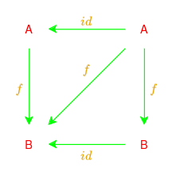

# CP - Ficha 1 - 18/09/2024

## Exercício 1

> Complete a codificação abaixo (em Haskell) das funções
$\text{length} :: [a] \to \mathbb{Z}$ e $\text{reverse} :: [a] \to [a]$
que, respetivamente, calculam o comprimento da lista de entrada e a invertem:
> ```hs
> length [] = ...
> length (x:xs) = ...
> reverse [] = ...
> reverse (x:xs) = ...
> ```

### Resolução 1

```hs
length :: [a] -> Int
length [] = 0
length (x:xs) = 1 + length xs
```

```hs
reverse :: [a] -> [a]
reverse [] = []
reverse (x:xs) = reverse xs ++ [x]
```

## Exercício 2

> A função $\text{take} :: \mathbb{Z} \to [a] \to [a]$
é tal que $\text{take} \; n \; x$ é o mais longo prefixo da lista $x$
cujo comprimento não excede $n$.
Complete a seguinte formulação de uma propriedade da função $\text{take}$:
>
> ```hs
> take m (take n x ) = take (m . . . n) x
> ```

### Resolução 2

```hs
take m (take n x) = take (m `min` n) x
```

<div style="page-break-after: always;"></div>

## Exercício 3

> Apresente definições em Haskell das seguintes
funções que estudou em PF:
>
> ```hs
> map :: (a -> b) -> [a] -> [b]
> filter :: (a -> Bool) -> [a] -> [a]
> uncurry :: (a -> b -> c) -> (a, b) -> c
> curry :: ((a, b) -> c) -> a -> b -> c
> flip :: (a -> b -> c) -> b -> a -> c
> ```

### Resolução 3

```hs
map :: (a -> b) -> [a] -> [b]
map _ [] = []
map f (x:xs) = f a : map f xs
```

```hs
filter :: (a -> Bool) -> [a] -> [a]
filter _ [] = []
filter f (x:xs)
    | f x = x : filter f xs
    | otherwise = filter f xs
```

```hs
uncurry :: (a -> b -> c) -> (a, b) -> c
uncurry f (x,y) = f x y
```

```hs
curry :: ((a, b) -> c) -> a -> b -> c
curry f x y = f (x,y)
```

```hs
flip :: (a -> b -> c) -> b -> a -> c
flip f x y = f y x
```

<div style="page-break-after: always;"></div>

## Exercício 4

> A **composição** de funções define-se, em Haskell, tal como na matemática:
>
> $$ (f \circ g) \; x = f(g \; x) \tag{F1}$$
>
> Calcule $(f \circ g) \; x$ para os casos seguintes:
>
> $$
> \left\{
> \begin{align*}
> f \; x &= 2 \times x \\
> g \; x &= x + 1
> \end{align*}
> \right.
> \quad
> \left\{
> \begin{align*}
> f      &= succ       \\
> g \; x &= 2 \times x
> \end{align*}
> \right.
> \quad
> \left\{
> \begin{align*}
> f &= succ   \\
> g &= length
> \end{align*}
> \right.
> \quad
> \left\{
> \begin{align*}
> g \; (x,y) &= x + y                 \\
> f          &= succ \circ (2 \times)
> \end{align*}
> \right.
> $$
>
> Anime as composições funcionais acima num interpretador de Haskell.

### Resolução 4

#### a)

$$
\begin{align*}
f \; x &= 2 \times x \quad &\text{Assume-se que: } f &:: \text{Int} \to \text{Int} \\
g \; x &= x + 1      \quad                        &g &:: \text{Int} \to \text{Int}
\end{align*}
$$

$$
\begin{align*}
(f \circ g) \; x &= f \; (g \; x)    \tag{F1}           \\
                 &= f \; (x + 1)     \tag{Def. \( g \)} \\
                 &= 2 \times (x + 1) \tag{Def. \( f \)} \\
                 &= 2x + 2
\end{align*}
$$

---
<div style="page-break-after: always;"></div>

#### b)

$$
\begin{align*}
f      &= \text{succ} \quad &\text{Assume-se que: } f &:: \text{Int} \to \text{Int} \\
g \; x &= 2 \times x  \quad                        &g &:: \text{Int} \to \text{Int}
\end{align*}
$$


$$
\text{Point-wise notation:}
$$

$$
\begin{align*}
(f \circ g) \; x &= f \; (g \; x)            \tag{F1}           \\
                 &= f \; (2 \times x)        \tag{Def. \( g \)} \\
                 &= \text{succ }(2 \times x) \tag{Def. \( f \)} \\
                 &= 2x + 1
\end{align*}
$$


$$
\text{Point-free notation:}
$$

$$
\begin{align*}
(f \circ g) &= \text{succ} \circ (2 \times) \\
\end{align*}
$$

$$
\text{Definição de igualdade extensional:}
$$

$$
\begin{align*}
f &= \text{succ} &\equiv \forall x, \; f \; x &= \text{succ } x \tag{Igualdade extensional} \\
g &= (2 \times)  &\equiv \forall x, \; g \; x &= 2 \times x     \tag{Igualdade extensional}
\end{align*}
$$

---

#### c)

$$
\begin{align*}
f &= \text{succ}   \quad &\text{Assume-se que: } f &:: \text{Int} \to \text{Int} \\
g &= \text{length} \quad                        &g &:: [a] \to \text{Int}
\end{align*}
$$

$$
\begin{align*}
(f \circ g) \; x &= f \; (g \; x)                    \tag{F1}           \\
                 &= f \; (\text{length} \; x)        \tag{Def. \( g \)} \\
                 &= \text{succ }(\text{length} \; x) \tag{Def. \( f \)}
\end{align*}
$$

Note que a composição $g \circ f$ não é possível,
pois a função $f$ retorna um valor do tipo `Int`,
enquanto a função $g$ espera um argumento do tipo `[a]`.

---
<div style="page-break-after: always;"></div>

#### d)

$$
\begin{align*}
g \; (x,y) &= x + y                        \quad &\text{Assume-se que: } g &:: (\text{Int}, \text{Int}) \to \text{Int} \\
f          &= \text{succ} \circ (2 \times) \quad                        &f &:: \text{Int} \to \text{Int}
\end{align*}
$$

$$
\text{Point-wise notation:}
$$

$$
\begin{align*}
(f \circ g) \; x &= f \; (g \; (x,y))                         \tag{F1}           \\
                 &= f \; (x + y)                              \tag{Def. \( g \)} \\
                 &= (\text{succ} \circ (2 \times)) \; (x + y) \tag{Def. \( f \)} \\
                 &= \text{succ }(2 \times (x + y))                               \\
                 &= 2x + 2y + 1
\end{align*}
$$

$$
\text{Point-free notation:}
$$

$$
\begin{align*}
g \; (x,y)  &= x + y                                                      \\
            &= (+) \; x \; y                                              \\
            &= \text{uncurry} \; (+) \; (x,y)                             \\
            &\equiv                           \tag{Igualdade extensional} \\
g \;        &= \text{uncurry} \; (+)                                      \\
\text{Logo }
(f \circ g) &= \text{succ} \circ (2 \times) \circ (\text{uncurry} \; (+))
\end{align*}
$$

<div style="page-break-after: always;"></div>

## Exercício 5

> Mostre que $(f \circ g) \circ h = f \circ (g \circ h)$,
quaisquer que sejam $f$, $g$ e $h$.

### Resolução 5 (dedução)

$$
\begin{align*}
((f \circ g) \circ h) \; x &= (f \circ g) \; (h \; x) \tag{F1} \\
                           &= f \; (g \; (h \; x))    \tag{F1} \\
\\
(f \circ (g \circ h)) \; x &= f \; ((g \circ h) \; x) \tag{F1} \\
                           &= f \; (g \; (h \; x))    \tag{F1} \\
\end{align*}
$$

$$
\begin{align*}
\text{Assim, conclui-se que }
&\forall x, \; ((f \circ g) \circ h) \; x = (f \circ (g \circ h)) \; x \\
\text{e, por ig. extensional, temos que }
&(f \circ g) \circ h                      = f \circ (g \circ h)
\end{align*}
$$

### Resolução 5 (indução)

$$
\begin{align*}
\text{Hipótese de indução} \quad
&(f \circ g) \circ h = f \circ (g \circ h)                                                     \\
&\equiv                                                            \tag{Igualdade extensional} \\
&\forall x, \; ((f \circ g) \circ h) \; x = (f \circ (g \circ h)) \; x                         \\
&\equiv                                                            \tag{F1}                    \\
&(f \circ g) \circ (h \; x) = f \; ((g \circ h) \; x)                                          \\
&\equiv                                                            \tag{F1}                    \\
&f \; (g \; (h \; x)) = f \; (g \; (h \; x))                                                   \\
&\equiv                                                                                        \\
&\text{True}                                                                                   \\
\text{Logo }
&(f \circ g) \circ h = f \circ (g \circ h)
\end{align*}
$$

<div style="page-break-after: always;"></div>

## Exercício 6

> A função $\text{id} :: a \to a$ é tal que $\text{id} \; x = x$.
>
> Mostre que $f \circ \text{id} = \text{id} \circ f = f$ qualquer que seja $f$.

### Resolução 6

$$
\begin{align*}
(f \circ \text{id}) \; x &= f \; (\text{id} \; x)    \tag{F1}                    \\
                         &= f \; x                   \tag{Def. \(\text{id}\)}    \\
                         &= \text{id} \; (f \; x)    \tag{Def. \(\text{id}\)}    \\
                         &= (\text{id} \circ f) \; x \tag{F1}
\end{align*}
$$

$$
\begin{align*}
\text{Como }
&\forall x \in \text{Dom}(f), \; (f \circ \text{id}) \; x = (\text{id} \circ f) \; x \\
\text{implica, por ig. extensional, que }
&f \circ \text{id} = \text{id} \circ f \\
\text{e pela definição de id temos que }
&f \circ \text{id} = f \\
\text{então }
&f \circ \text{id}        = \text{id} \circ f = f
\end{align*}
$$

### Resolução 6 (alternativa)

$$
\begin{align*}
(f \circ \text{id}) \; x &= f \; (\text{id} \; x) \tag{F1}                    \\
                         &= f \; x                \tag{Def. \(\text{id}\)}    \\
                         &\equiv                  \tag{Igualdade extensional} \\
f \circ \text{id}        &= f                                                 \\
\\
(\text{id} \circ f) \; x &= \text{id} \; (f \; x) \tag{F1}                    \\
                         &= f \; x                \tag{Def. \(\text{id}\)}    \\
                         &\equiv                  \tag{Igualdade extensional} \\
\text{id} \circ f        &= f                                                 \\
\\
\text{Logo }
f \circ \text{id}        &= \text{id} \circ f = f
\end{align*}
$$

<div align="center">
    
</div>

<div style="page-break-after: always;"></div>

## Exercício 7

> Considere o seguinte problema:
>
>> *(...) For each **list of calls** stored in an old mobile phone
(eg. numbers dialed, SMS messages, lost calls),
the **store** operation should work in a way such that:*
>>
>> ***a)** the more recently a **call** is made the more accessible it is;*
>>
>> ***b)** no number appears twice in a list;*
>>
>> ***c)** only the most recent 10 entries in each list are stored.*
>
> Considere ainda a seguinte proposta de
resolução que usa a composição de funções,
uma por cada requisito do problema:
>
> ```hs
> store :: Eq a => a -> [a] -> [a]
> store c = take 10 . nub . (c:)  -- (F2)
> --          (a)     (b)   (c)
> ```

### Resolução 7

#### a)

> Usando a definição (F1) tantas vezes quanto necessário, avalie as expressões:
>
> ```hs
> store 7 [1 .. 10]
> store 11 [1 .. 10]
> ```

```hs
store 7 [1 .. 10] = take 10 . nub . (7:) $ [1 .. 10]
                  = take 10 . nub . (7:) $ [1,2,3,4,5,6,7,8,9,10]
                  = take 10 . nub $        [7,1,2,3,4,5,6,7,8,9,10]
                  = take 10 $              [7,1,2,3,4,5,6,8,9,10]
                  =                        [7,1,2,3,4,5,6,8,9,10]
```

```hs
store 11 [1 .. 10] = take 10 . nub . (11:) $ [1 .. 10]
                   = take 10 . nub . (11:) $ [1,2,3,4,5,6,7,8,9,10]
                   = take 10 . nub $         [11,1,2,3,4,5,6,7,8,9,10]
                   = take 10 $               [11,1,2,3,4,5,6,7,8,9,10]
                   =                         [11,1,2,3,4,5,6,7,8,9]
```

---
<div style="page-break-after: always;"></div>

#### b)

> Suponha que alguém usou a mesma abordagem ao problema,
mas enganou-se na ordem das etapas:
>
> ```hs
> store c = (c:) . take 10 . nub
> ```
>
> Qual é o problema desta solução? Que requisitos (a,b,c) viola?

Por esta ordem, a função viola dois dos requisitos definidos:
- **b)** Devido a inserção do elemento `c` ser após a chamada a função `nub`,
a função `store` não garante que não existem elementos repetidos.
- **c)** Como a inserção do elemento `c` é feita depois da chamada a `take 10`,
a função `store` não garante que apenas as 10 entradas mais recentes
são guardadas.

---

#### c)

> E se o engano for como escreve a seguir?
>
> ```hs
> store c = nub . (c:) . take 10
> ```
>
> Conclua que a composição não é mesmo nada
comutativa - a ordem entre as etapas de uma
solução composicional é importante!

Neste caso, a função `store` viola o requisito **c)**,
como a função `take 10` é chamada antes de ser feita a inserção de `c`,
em certos casos a função `store` retorna uma lista com 11 elementos,
explicitamente quando é adicionado um elemento `c` a uma lista de 10 elementos
sem repetições e `c` não pertence a essa lista.

<div style="page-break-after: always;"></div>

## Exercício 8

> Voltando a agora à definição *certa* (F2),
suponha que submete ao seu interpretador de Haskell a expressão:
>
> ```hs
> store "Maria" ["Manuel", "Tia Irene", "Maria", "Augusto"]
> ```
> Que espera do resultado? Vai dar erro? Tem que mexer em (F2) para funcionar?
Que propriedade da linguagem é evidenciada neste exemplo?

### Resolução 8

Resultado esperado: `["Maria", "Manuel", "Tia Irene", "Augusto"]`

```hs
store "Maria" ["Manuel", "Tia Irene", "Maria", "Augusto"]
= take 10 . nub . ("Maria":) $ ["Manuel", "Tia Irene", "Maria", "Augusto"]
= take 10 . nub $              ["Maria", "Manuel", "Tia Irene", "Maria", "Augusto"]
= take 10 $                    ["Maria", "Manuel", "Tia Irene", "Augusto"]
=                              ["Maria", "Manuel", "Tia Irene", "Augusto"]
```

Não ocorre erro, pois a função `store` foi definida para lidar com
listas de qualquer tipo, desde que este seja uma instância de `Eq`,
visto que é usada a função `nub`, que requer a comparação de elementos.

Em Haskell, `String` (uma lista de caracteres) é uma instância de `Eq`,
o que significa que `nub` pode operar corretamente sobre ela.

Deste modo, não é necessário alterar a função `store`
para que esta funcione corretamente.

A propriedade de Haskell evidenciada neste exemplo é o **polimorfismo (ad-hoc)**.

