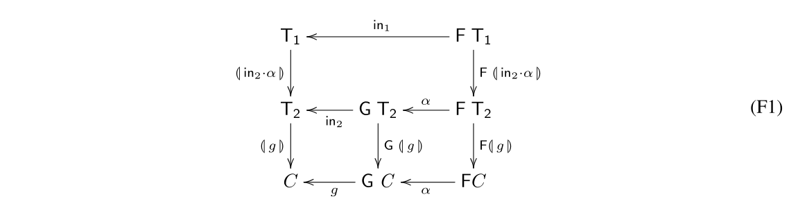

# CP - Ficha 11

## Exercício 1

> O diagrama que se segue
>
> 

> 
> 

>
> compõe dois catamorfismos envolvendo dois tipos $T_1$ (F-recursivo) e $T_2$ (G-recursivo):
>
> $$
> \begin{align*}
> &\lb g \rb : T_2 \to C \\
> &\lb \text{in}_2 \cdot \alpha \rb : T_1 \to T_2
> \end{align*}
> $$
>
> Considere-se o caso especial:
>
> $$
> \begin{align*}
> &T_1 = T_2 = \text{LTree} \; A \\
> &F \; f = id + f \times f \\
> &\alpha = id + \text{swap} \\
> &\text{in}_2 = [Leaf, Fork]
> \end{align*}
> $$
>
> Desenvolver
>
> $$mirror = \lb \text{in}_2 \cdot \alpha \rb \tag{F2}$$
>
> até se obter uma definição completamente *pointwise*.

### Resolução 1

$$
\begin{align*}
&mirror = \lb \text{in}_2 \cdot \alpha \rb \\
&\equiv \tag{\small{46: Universal-cata}} \\
&mirror \cdot \text{in}_2 = \text{in}_2 \cdot \alpha \cdot \text{F mirror} \\
&\equiv \tag{\small{Def. in$_2$, Def. $\alpha$, Def. Functor LTree}} \\
&mirror \cdot [Leaf, Fork] = [Leaf, Fork] \cdot (id + \text{swap}) \cdot (id + mirror^2) \\
&\equiv \tag{\small{20: Fusão-+, 22: Absorção-+}} \\
&[mirror \cdot Leaf, mirror \cdot Fork] = [Leaf, Fork \cdot \text{swap} \cdot mirror^2] \\
&\equiv \tag{\small{27: Eq-+}} \\
&\begin{cases}
mirror \cdot Leaf = Leaf \\
mirror \cdot Fork = Fork \cdot \text{swap} \cdot mirror^2
\end{cases} \\
&\equiv \tag{\small{72: Ig. Ext., 73 Def-comp, 78: Def-×, Def. swap}} \\
&\begin{cases}
mirror \; (Leaf \; a) = Leaf \; a \\
mirror \; (Fork \; (l,r)) = Fork \; (mirror \; r, mirror \; l)
\end{cases}
\end{align*}
$$

## Exercício 2

> A lei
>
> $$\lb g \rb \cdot \lb \text{in}_2 \cdot \alpha \rb = \lb g \cdot \alpha \rb \Leftarrow G \; f \cdot \alpha = \alpha \cdot F \; f \tag{F3}$$
>
> verifica-se — cf. diagrama anterior — onde a condição
>
> $$G \; f \cdot \alpha = \alpha \cdot F \; f \tag{F4}$$
>
> mais não é que a propriedade grátis de $\alpha : F \; X \to G \; X$.
> Apresente justificações para a seguinte demonstração de (F3):
>
> [...]

$$
\begin{align*}
&\lb g \rb \cdot \lb \text{in}_2 \cdot \alpha \rb = \lb g \cdot \alpha \rb \\
&\Leftarrow \tag{\small{49: Fusão-cata}} \\
&\lb g \rb \cdot \text{in}_2 \cdot \alpha = g \cdot \alpha \cdot \text{F} \; \lb g \rb \\
&\equiv \tag{\small{47: Cancelamento-cata}} \\
&g \cdot \text{G} \; \lb g \rb \cdot \alpha = g \cdot \alpha \cdot \text{F} \; \lb g \rb \\
&\Leftarrow \tag{\small{5: Leibniz}} \\
&\text{G} \; \lb g \rb \cdot \alpha = \alpha \cdot \text{F} \; \lb g \rb \\
&\equiv \tag{\small{$f = \lb g \rb$}} \\
&\text{G} \; f \cdot \alpha = \alpha \cdot \text{F} \; f
\end{align*}
$$

## Exercício 3

> Na sequência da questão 1 acima, suponha que se tem $\lb g \rb= mirror$ em (F1).
> Mostre por (F3) que
>
> $$mirror \cdot mirror = id \tag{F5}$$
>
> se verifica.

### Resolução 3

$$
\begin{align*}
&mirror \cdot mirror = id \\
&\equiv \tag{\small{$mirror = \lb g \rb$, Def. $g$, Def. $\alpha$, 48: Reflexão-cata}} \\
&\lb \text{in} \cdot (id + \text{swap}) \rb \cdot \lb \text{in} \cdot (id + \text{swap}) \rb = \lb \text{in} \rb \\
&\Leftarrow \tag{\small{E1, F3}} \\
&\text{G} \; f \cdot (id + \text{swap}) = (id + \text{swap}) \cdot \text{F} \; f \\
&\equiv \tag{\small{$\text{G} \; f = \text{F} \; f = id + f^2$}} \\
&(id + f^2) \cdot (id + \text{swap}) = (id + \text{swap}) \cdot (id + f^2) \\
&\equiv \tag{\small{25: Functor-+ (2×)}} \\
& id + (\text{swap} \cdot (f \times f)) = id + ((f \times f) \cdot \text{swap}) \\
&\equiv \tag{\small{Prop. grátis de swap}} \\
&\text{True}
\end{align*}
$$

$$
\begin{align*}
\text{\small{(E1) Mostrar que}} \quad &\text{in} = (\text{in} \cdot (id + \text{swap})) \cdot (id + \text{swap}) \\
&\equiv \tag{\small{2: Assoc-comp, 25: Functor-+, 1: Natural-id}} \\
&\text{in} = \text{in} \cdot (id + \text{swap} \cdot \text{swap}) \\
&\equiv \tag{\small{$\text{swap} \cdot \text{swap} = id$}} \\
&\text{in} = \text{in} \cdot (id + id) \\
&\equiv \tag{\small{26: Functor-id-+}} \\
&\text{True}
\end{align*}
$$

$$
\text{Propriedade grátis de swap: } \\[.25em]
(g \times f) \cdot \text{swap} = \text{swap} \cdot (f \times g)
\\[.75em]
\begin{array}{ccc}
A \times B & \xrightarrow{\qquad\text{swap}\qquad} & B \times A \\
\Big\vert & & \Big\vert \\
f \times g & & g \times f \\
\Big\downarrow & & \Big\downarrow \\
A' \times B' & \xrightarrow{\qquad\text{swap}\qquad} & B' \times A' \\
\end{array}
$$

## Exercício 4

> Recordando a definição $T \; f = \lb \text{in} \cdot \text{B} \; (f, id) \rb$,
> mostre que a lei de absorção-cata,
>
> $$\lb g \rb \cdot T \; f = \lb g \cdot \text{B} \; (f, id) \rb$$
>
> é um caso particular de (F3).

### Resolução 4

$$
\begin{align*}
&\lb g \rb \cdot T \; f = \lb g \cdot \text{B} \; (f, id) \rb \\
&\equiv \tag{\small{51: Def-map-cata}} \\
&\lb g \rb \cdot \lb \text{in} \cdot \text{B} \; (f, id) \rb = \lb g \cdot \text{B} \; (f, id) \rb \\
&\Leftarrow \tag{\small{F3}} \\
&\text{G} \; f \cdot \text{B} \; (f, id) = \text{B} \; (f, id) \cdot \text{F} \; f \\
&\equiv \tag{\small{$\text{G} \; f= \text{F} \; f$, 50: Base-cata}} \\
&\text{B} \; (id, f) \cdot \text{B} \; (f, id) = \text{B} \; (f, id) \cdot \text{B} \; (id, f) \\
&\equiv \tag{\small{$\text{B} \; (f \cdot g, h \cdot k) = \text{B} \; (f, h) \cdot \text{B} \; (g, k)$}} \\
&\text{True}
\end{align*}
$$

## Exercício 5

> Todo o ciclo-*while* que termina pode ser definido por
>
> $$\textbf{while} \; p \; f \; g = \textbf{tailr} \; ((g + f) \cdot (\neg \cdot p)?) \tag{F6}$$
>
> recorrendo ao combinador de “tail recursion”
>
> $$\textbf{tailr} \; f = \lh \text{join}, f \rh \tag{F7}$$
>
> que é um hilomorfismo de base $B (X, Y) = X + Y$, para $\text{join} = [id, id]$.
>
> Derive uma definição *pointwise* de $\textbf{while} \; p \; f \; g$, sabendo que qualquer
> $h = \lh f, g \rh$ que termina é tal que $h = f \cdot F \; h \cdot g$.

### Resolução 5

$$
\begin{align*}
\textbf{while} \; p \; f \; g &= \textbf{tailr} \; ((g + f) \cdot (\neg \cdot p)?) \\
&\tag{\small{F7, Def. join}} \\
&= \lh [id, id], (g + f) \cdot (\neg \cdot p)? \rh \\
&\tag{\small{$h = \lh f, g \rh \equiv h = f \cdot F \; h \cdot g$, $\text{F} \; f = \text{B} \; (id, f) = id + f$}} \\
&= [id, id] \cdot (id + \textbf{while} \: p \: f \: g) \cdot (g + f) \cdot (\neg \cdot p)? \\
&\tag{\small{25: Functor-+, 22: Absorção-+}} \\
&= [g, (\textbf{while} \: p \: f \: g) \cdot f] \cdot (\neg \cdot p)? \\
&\tag{\small{30: Def. condicional de McCharty}} \\
&= (\neg \cdot p) \to g, (\textbf{while} \: p \: f \: g) \cdot f \\
&\tag{\small{$\neg \cdot p \to g, f = p \to f, g$}} \\
&= p \to (\textbf{while} \: p \: f \: g) \cdot f, g \\
&\equiv \tag{\small{72. Ig. Ext., 82: Def-cond}} \\
\textbf{while} \; p \; f \; g \; x &= \textbf{if } p \; x \textbf{ then } (\textbf{while} \: p \: f \: g) \cdot f \; x
                                                          \textbf{ else } g \; x
\end{align*}
$$

## Exercício 6

> Considere a seguinte lei de fusão de $\textbf{tailr}$,
> válida sempre que $\textbf{tailr} \; g \cdot f$ termina:
>
> $$(\textbf{tailr} \; g) \cdot f = \textbf{tailr} \; h \Leftarrow (id + f) \cdot h = g \cdot f \tag{F8}$$
>
> Complete a seguinte demonstração dessa lei:
>
> [...]

### Resolução 6

$$
\begin{align*}
&(\textbf{tailr} \; g) \cdot f = \textbf{tailr} \; h \\
&\equiv \tag{\small{F7: Def. hylo. de \textbf{tailr}}} \\
&\lb \Delta \rb \cdot \la g \ra \cdot f = \lb \Delta \rb \cdot \la h \ra \\
&\Leftarrow \tag{\small{5: Leibniz}} \\
&\la g \ra \cdot f = \la h \ra \\
&\Leftarrow \tag{\small{58: Fusão-ana, $\text{F} \; f = id + f$}} \\
&g \cdot f = (id + f) \cdot h
\end{align*}
$$

$\square$

## Exercício 7

> Um mónade é um functor $T$ equipado com duas funções $\mu$ e $u$,
>
> $$A \xrightarrow{\quad u \quad} T \; A \xleftarrow{\quad \mu \quad} T \; (T \; A) \tag{F9}$$
>
> que satisfazem as propriedades
>
> $$
> \begin{align*}
> &\mu \cdot u = id = \mu \cdot T \; u \tag{F10} \\
> &\mu \cdot \mu = \mu \cdot T \; \mu \tag{F11}
> \end{align*}
> $$
>
> para além das respetivas propriedades “grátis”, onde $T^2 \; f$ abrevia $T \; (T \; f)$:
>
> $$
> \begin{align*}
> &T \; f \cdot u = u \cdot f \tag{F12} \\
> &T \; f \cdot \mu = \mu \cdot T^2 \; f \tag{F13}
> \end{align*}
> $$
>
> Partindo da definição de composição monádica,
>
> $$f \bullet g = \mu \cdot T \; f \cdot g \tag{F14}$$
>
> demonstre os factos seguintes:
>
> $$
> \begin{align*}
> \mu                   \quad &=     \quad id \bullet id \tag{F15} \\
> f \bullet u = f       \quad &\land \quad f = u \bullet f \tag{F16} \\
> (f \cdot g) \bullet h \quad &=     \quad f \bullet (T \; g \cdot h) \tag{F17} \\
> T \; f                \quad &=     \quad (u \cdot f) \bullet id \tag{F18}
> \end{align*}
> $$

### Resolução 7

$$
\text{F15}
$$

$$
\begin{align*}
&id \bullet id \\
&=\tag{\small{66: Composição monádica}} \\
&\mu \cdot T \; id \cdot id \\
&=\tag{\small{45: Functor-id-F}} \\
&\mu \cdot id \cdot id \\
&=\tag{\small{1: Natural-id (2×)}} \\
&\mu
\end{align*}
$$

$$
\\[2em]
\text{F16}
$$

$$
\begin{align*}
&f \bullet u \\
&=\tag{\small{66: Composição monádica}} \\
&\mu \cdot T \; f \cdot u \\
&=\tag{\small{64: Natural-$u$}} \\
&\mu \cdot u \cdot f \\
&=\tag{\small{63: Unidade, 1: Natural-id}} \\
&f
\end{align*}
$$

$$
\begin{align*}
&u \bullet f \\
&=\tag{\small{66: Composição monádica}} \\
&\mu \cdot T \; u \cdot f \\
&=\tag{\small{63: Unidade, 1: Natural-id}} \\
&f
\end{align*}
$$

$$
\\[2em]
\text{F17}
$$

$$
\begin{align*}
&(f \cdot g) \bullet h \\
&=\tag{\small{66: Composição monádica}} \\
&\mu \cdot T \; (f \cdot g) \cdot h \\
&=\tag{\small{44: Functor-F, 2: Assoc-comp}} \\
&\mu \cdot T \; f \cdot (T \; g \cdot h) \\
&=\tag{\small{66: Composição monádica}} \\
&f \bullet (T \; g \cdot h)
\end{align*}
$$

$$
\\[2em]
\text{F18}
$$

$$
\begin{align*}
&(u \cdot f) \bullet id \\
&=\tag{\small{66: Composição monádica}} \\
&\mu \cdot T \; (u \cdot f) \cdot id \\
&=\tag{\small{44: Functor-F, 1: Natural-id}} \\
&\mu \cdot T \; u \cdot T \; f \\
&=\tag{\small{63: Unidade, 1: Natural-id}} \\
&T \; f
\end{align*}
$$
