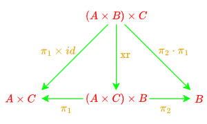
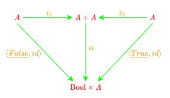

# CP - Ficha 2 - 18/09/2024

## Exercício 1

> O circuito booleano
>
> [...]
>
> pode descrever-se pela função $f$ que se segue,
>
> $$
> \left\{
> \begin{aligned}
> &f : (\mathbb{B} \times \mathbb{B}) \times \mathbb{B} \to \mathbb{B} \\
> &f = xor \circ (and \times id)
> \end{aligned}
> \right.
> \tag{F1}
> $$
>
> onde $and \; (a, b) = a \land b$ e $xor \; (x, y) = x \oplus y$.
>
> a) Mostre que f se pode também definir como se segue:
> $$f \; ((a, b), c) = (a \land b) \oplus c$$
>
> b) Qual o tipo da função $g = \langle \pi_1, f \rangle$?

### Resolução 1

#### a)

$$
\begin{align*}
f \; ((a, b), c) &= (a \land b) \oplus c                                        \\
                 &= xor \; ((a \land b), c)                  \tag{Def. xor}     \\
                 &= xor \; (and \; (a, b), c)                \tag{Def. and}     \\
                 &= xor \; (and \; (a, b), id \; c)          \tag{74: Def-id}   \\
                 &= xor \; ((and \times id) \; ((a, b), c))  \tag{78: Def-×}    \\
                 &= xor \circ (and \times id) \; ((a, b), c) \tag{73: Def-comp} \\
                 &\equiv                                     \tag{72: Ig. Ext.} \\
               f &= xor \circ (and \times id)
\end{align*}
$$

<div style="page-break-after: always;"></div>

#### b)

$$
\begin{align*}
f     &: (\mathbb{B} \times \mathbb{B}) \times \mathbb{B} \to \mathbb{B} \\
\pi_1 &: A \times C \to A                                                \\
\end{align*}
$$

$$
\begin{align*}
\text{Se} \quad    &A = \mathbb{B} \times \mathbb{B}                                                          \\
\text{e} \quad     &C = \mathbb{B}                                                                            \\
\text{então} \quad &\pi_1 : (\mathbb{B} \times \mathbb{B}) \times \mathbb{B} \to \mathbb{B} \times \mathbb{B} \\
\\
\text{Como} \quad  &g = \langle \pi_1, f \rangle \\
\text{então} \quad &g : (\mathbb{B} \times \mathbb{B}) \times \mathbb{B} \to (\mathbb{B} \times \mathbb{B}) \times \mathbb{B} \\
\end{align*}
$$


<div align="center">
  
</div>

<div style="page-break-after: always;"></div>

## Exercício 2

> Implemente e teste $f$ (F1) no GHCi, após carregar a
biblioteca $Cp.hs$ disponível no material pedagógico.
>
> NB: recorde que $x \oplus y = x \neq y$.

### Resolução 2

```
ghci> :load lib/Cp.hs
[1 of 1] Compiling Cp               ( lib/Cp.hs, interpreted )
Ok, one module loaded.
ghci> f ((a, b), c) = (a && b) /= c
ghci> :type f
f :: ((Bool, Bool), Bool) -> Bool
```

Tabela de verdade:

| $a$ | $b$ | $c$ | $f \; ((a, \; b), \; c)$ |
|-----|-----|-----|--------------------------|
| 0   | 0   | 0   | 0                        |
| 0   | 0   | 1   | 1                        |
| 0   | 1   | 0   | 0                        |
| 0   | 1   | 1   | 1                        |
| 1   | 0   | 0   | 0                        |
| 1   | 0   | 1   | 1                        |
| 1   | 1   | 0   | 1                        |
| 1   | 1   | 1   | 0                        |

<div style="page-break-after: always;"></div>

## Exercício 3

> Defina no GHCi o seguinte tipo de dados:
>
> ```haskell
> data X = B Bool | P (Bool,Int)
> ```
>
> Peça ao GHCi informação sobre os tipos de $B$ e de $P$
e deduza que são funções tais que $f = [B, P]$ faz sentido.
Qual é o tipo de $f$?
>
> NB: em Haskell a alternativa [f, g] escreve-se `either f g`.

### Resolução 3

```
ghci> data X = B Bool | P (Bool, Int)
ghci> :type B
B :: Bool -> X
ghci> :type P
P :: (Bool, Int) -> X
ghci> :type either B P
either B P :: Either Bool (Bool, Int) -> X
```

Como $f = [B, P] = \text{either} \; B \; P$,
então $f$ é uma função que recebe \
um valor do tipo `Either B P`, ou seja `Either Bool (Bool, Int)`, \
e devolve um valor do tipo $X$.

```haskell
f :: Either Bool (Bool, Int) -> X
```

Equivalente a:

$f \; : \; \mathbb{B} + (\mathbb{B} \times \text{Int}) \to \text{X}$

<div align="center">
  
</div>

<div style="page-break-after: always;"></div>

## Exercício 4

> O combinador $\langle f, g \rangle$ - isto é,
*“$f$ em paralelo com $g$”* - satisfaz a seguinte propriedade,
dita **universal**:
>
> $$
> k = \langle f, g \rangle
> \quad \equiv \quad
> \left\{
> \begin{aligned}
> \pi_1 \circ k = f \\
> \pi_2 \circ k = g
> \end{aligned}
> \right.
> \tag{F2}
> $$
>
> Identifique-a no [formulário](https://haslab.github.io/CP/Material/cpCalFun.pdf).
Que outra propriedade desse formulário obtém fazendo $k = id$ e simplificando?

### Resolução 4

$$
k = \langle f, g \rangle
\quad \Leftrightarrow \quad
\left\{
\begin{aligned}
\pi_1 \circ k = f \\
\pi_2 \circ k = g
\end{aligned}
\right.
\tag{6: Universal-×}
$$

<br />

$$
\begin{align*}
\text{Se} \quad &k = id \\
\quad \text{então} \quad &id = \langle f, g \rangle \Leftrightarrow
\left\{
\begin{aligned}
\pi_1 \circ id = f \\
\pi_2 \circ id = g
\end{aligned}
\right.
\\
&\equiv
\tag{1: Natural-id}
\\
&id = \langle f, g \rangle \Leftrightarrow
\left\{
\begin{aligned}
\pi_1 = f \\
\pi_2 = g
\end{aligned}
\right.
\\
\text{Substituindo temos:} \quad &id = \langle \pi_1, \pi_2 \rangle \\
&\equiv \\
&\langle \pi_1, \pi_2 \rangle = id_{\scriptstyle A \times B}
\tag{8: Reflexão-×}
\end{align*}
$$

<div style="page-break-after: always;"></div>

## Exercício 5

> Derive a partir de (F2) a lei
>
> $$
> \langle h, \; k \rangle \circ f = \langle h \circ f, \; k \circ f \rangle
> $$
>
> que também consta desse [formulário](https://haslab.github.io/CP/Material/cpCalFun.pdf)
sob a designação $\text{fusão-}\times$.

### Resolução 5

$$
\begin{align*}
&\langle h, \; k \rangle \circ f = \langle h \circ f, \; k \circ f \rangle \\
&\equiv \tag{6: Universal-×, 2: Assoc-comp} \\
&\left\{
\begin{aligned}
(\pi_1 \circ \langle h, \; k \rangle) \circ f &= h \circ f \\
(\pi_2 \circ \langle h, \; k \rangle) \circ f &= k \circ f
\end{aligned}
\right. \\
&\equiv \tag{7: Cancelamento-×} \\
&\left\{
\begin{aligned}
h \circ f &= h \circ f \\
k \circ f &= k \circ f
\end{aligned}
\right. \quad \text{c.q.m.}
\end{align*}
$$

<div style="page-break-after: always;"></div>

## Exercício 6

> Uma das operações essenciais em processamento
da informação é a sua *duplicação*:
>
> [...]
>
> $$
> dup \; x = (x, x)
> $$
>
> Recorra à lei de $\text{fusão-}\times$ para demonstrar
a seguinte propriedade da duplicação de
informação:
>
> $$
> dup \circ f = \langle f, f \rangle
> $$

### Resolução 6

$$
\begin{align*}
&dup \; x = (x, x)                      \\
&\equiv \tag{74: Def-id}                \\
&dup \; x = (id \; x, id \; x)          \\
&\equiv \tag{77: Def-split}             \\
&dup \; x = \langle id, id \rangle \; x \\
&\equiv \tag{72: Ig. Ext.}              \\
&dup = \langle id, id \rangle           \\
\\
\text{Então} \quad &dup \circ f = \langle id, id \rangle \circ f \\
&\equiv \tag{9: Fusão-×} \\
&dup \circ f = \langle id \circ f, id \circ f \rangle \\
&\equiv \tag{1: Natural-id} \\
&dup \circ f = \langle f, f \rangle \quad \text{c.q.m.}
\end{align*}
$$

<div style="page-break-after: always;"></div>

## Exercício 7

> Considere a função:
>
> $$
> \text{xr} = \langle \pi_1 \times id, \; \pi_2 \circ \pi_1 \rangle
> $$
>
> Mostre que $\text{xr}$ satisfaz a propriedade
>
> $$
> \text{xr} \circ \langle \langle f, g \rangle, h \rangle = \langle \langle f, h \rangle, g \rangle
> $$
>
> para todo $f$, $g$ e $h$.

### Resolução 7

$$
\begin{align*}
&\langle \pi_1 \times id, \; \pi_2 \circ \pi_1 \rangle \circ \langle \langle f, g \rangle, h \rangle \\
&= \tag{9: Fusão-×} \\
&\langle (\pi_1 \times id) \circ \langle \langle f, g \rangle, h \rangle, \; (\pi_2 \circ \pi_1) \circ \langle \langle f, g \rangle, h \rangle \rangle \\
&= \tag{11: Absorção-×, 2: Assoc-comp} \\
&\langle \langle \pi_1 \circ \langle f, g \rangle, \; id \circ h \rangle, \; \pi_2 \circ (\pi_1 \circ \langle \langle f, g \rangle, h \rangle ) \rangle \\
&= \tag{7: Cancelamento-×, 1: Natural-id} \\
&\langle \langle f, \; h \rangle, \; g \rangle \quad \text{c.q.m.}
\end{align*}
$$

#### Extra: Qual o tipo de $\text{xr}$?

<div align="center">
  
</div>

<div style="page-break-after: always;"></div>

## Exercício 8

> O combinador
>
> ```haskell
> const :: a -> b -> a
> const a b = a
> ```
>
> está disponível em Haskell para construir
funções constantes, sendo habitual designarmos
$\text{const} \; k$ por $\underline{k}$.
Demonstre a igualdade
>
> $$
> \underline{(b,a)} = \langle \underline{b}, \underline{a} \rangle
> $$
>
> a partir da propriedade universal do produto e
das propriedades das funções constantes que
constam do formulário.

### Resolução 8

$$
\begin{align*}
&\underline{(b, a)} = \langle \underline{b}, \underline{a} \rangle \\
&\equiv \tag{6: Universal-×} \\
&\underline{(b, a)} =
\left\{
\begin{aligned}
\pi_1 \circ \underline{(b, a)} = \underline{b} \\
\pi_2 \circ \underline{(b, a)} = \underline{a}
\end{aligned}
\right. \\
&\equiv \\
&\underline{(b, a)} = (\underline{b}, \underline{a}) \\
&\equiv \\
&\underline{(b, a)} = \underline{(b, a)}
\end{align*}
$$

<div style="page-break-after: always;"></div>

## Exercício 9

> Determine o tipo da função $\alpha$ que se segue:
>
> $$
> \alpha = [\langle \text{\underline{False}}, id \rangle, \langle \text{\underline{True}}, id \rangle]
> $$

### Resolução 9

Para definir o tipo mais geral de $\alpha$, vamos primeiro determinar o tipo
mais geral de cada uma das funções que a compõem:

$$
\begin{align*}
\underline{False}                     &: A \to \text{Bool} \\
\langle \underline{False}, id \rangle &: \text{A} \to \text{Bool} \times \text{A} \\
\\
\underline{True}                      &: B \to \text{Bool} \\
\langle \underline{True},  id \rangle &: \text{B} \to \text{Bool} \times \text{B} \\
\end{align*}
$$

Temos assim:

$$
\alpha : A + B \to \text{Bool} \times (A + B)
$$

<div align="center">
  
</div>

**Dúvida**

A composição alternativa condiciona o tipo de saída dos seus argumentos?

O tipo de $\langle \underline{False}, id \rangle$ tem de ser igual ao de $\langle \underline{True}, id \rangle$?

Se sim então $\alpha : A \to \text{Bool} \times A$?

<div style="page-break-after: always;"></div>

## Exercício 10

> **Questão Prática**: - [...] Dão-se a seguir os requisitos do problema.
>
>> ***Problem requirements**: Given a name, for instance `"Jose Nuno Oliveira"` we
>> wish to obtain its acronym and its short version, as suggested below:*
>> ```
>> *Cp> acronym "Jose Nuno Oliveira"
>> "JNO"
>> *Cp> short "Jose Nuno Oliveira"
>> "Jose Oliveira"
>> *Cp>
>> ```
>>
>> *Define*
>> ```
>> acronym = ...
>> short = ...
>> ```
>>
>> *subject to the following restrictions: \
>> • you cannot use argument variables ($x$, $y$, ...) \
>> • you can use function composition $f \circ g$ and the parallel combinator $\langle f, g\rangle$ as well as
any function available from module $Cp.hs$ \
>> • you can resort to Haskell standard functions such as e.g. `map`, `filter` and so on.*

### Resolução 10

```haskell
acronym = map head . words
short = (\ws -> head ws ++ " " ++ last ws) . words
```
