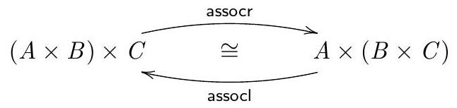
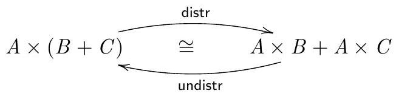
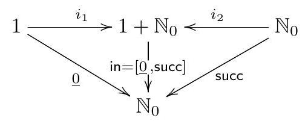
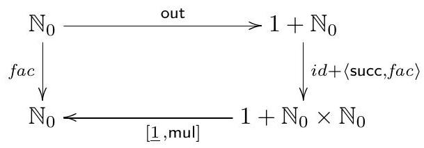

# CP - Ficha 3

## Exercício 1

> Considere o diagrama
>
> <div align="center">
>   
> </div>
>
> onde $\text{assocl} = \langle id \times \pi_1, \pi_2 \cdot \pi_2 \rangle$.
Apresente justificações para o cálculo que se segue em
que se resolve em ordem a $\text{assocr}$ a equação
$\text{assocl} \cdot \text{assocr} = id$:

### Resolução 1

$$
\begin{align*}
&\text{assocl} \cdot \text{assocr} = id \\
&\equiv \text{\quad \small{(Def. assocl, 9: Fusão-×, 6: Universal-×, 1: Natural-id)}} \\
&\left\{
\begin{aligned}
(id \times \pi_1) \cdot \text{assocr} = \pi_1 \\
\pi_2 \cdot \pi_2 \cdot \text{assocr} = \pi_2
\end{aligned}
\right. \\
&\equiv \text{\quad \small{(10: Def-×, 1: Natural-id, 9: Fusão-×, 6: Universal-×)}} \\
&\left\{
\begin{aligned}
\left\{
\begin{aligned}
\pi_1 \cdot \text{assocr} = \pi_1 \cdot \pi_1             \\
\pi_1 \cdot \pi_2 \cdot \text{assocr} = \pi_2 \cdot \pi_1
\end{aligned}
\right. \\
\pi_2 \cdot \pi_2 \cdot \text{assocr} = \pi_2
\end{aligned}
\right. \\
&\equiv \text{\quad \small{(6: Universal-×)}} \\
&\left\{
\begin{aligned}
\pi_1 \cdot \text{assocr} = \pi_1 \cdot \pi_1             \\
\left\{
\begin{aligned}
\pi_1 \cdot \pi_2 \cdot \text{assocr} = \pi_2 \cdot \pi_1 \\
\pi_2 \cdot \pi_2 \cdot \text{assocr} = \pi_2
\end{aligned}
\right. \\
\end{aligned}
\right. \\
&\equiv \text{\quad \small{(6: Universal-×)}} \\
&\left\{
\begin{aligned}
\pi_1 \cdot \text{assocr} = \pi_1 \cdot \pi_1             \\
\pi_2 \cdot \text{assocr} = \langle \pi_2 \cdot \pi_1, \pi_2 \rangle
\end{aligned}
\right. \\
&\equiv \text{\quad \small{(6: Universal-×, 1: Natural-id, 10: Def-×)}} \\
&\text{assocr} = \langle \pi_1 \cdot \pi_1, \pi_2 \times id \rangle \tag{F1}
\end{align*}
$$

<div style="page-break-after: always;"></div>

## Exercício 2

> a) Codifique (F1) diretamente em Haskell e verifique
o comportamento dessa função no GHCi.
>
> b) De seguida, converta — por igualdade extensional —
(F1) para notação Haskell pointwise que não recorra a
nenhum combinador nem projecção e verifique no GHCi que as
duas versões dão os mesmos resultados.

### Resolução 2

#### a)

```haskell
ghci> assocr = split (p1 . p1) (p2 >< id)
ghci> assocr ((1,2),3)
(1,(2,3))
ghci> assocr (("Hi",True),3.14)
("Hi",(True,3.14))
```

#### b)

$$
\begin{align*}
&assocr = \langle \pi_1 \cdot \pi_1, \pi_2 \times id \rangle \\
&\equiv \tag{72: Ig. Ext.} \\
&assocr \; ((a,b),c) = \langle \pi_1 \cdot \pi_1, \pi_2 \times id \rangle \; ((a,b),c) \\
&\equiv \tag{77: Def-split} \\
&assocr \; ((a,b),c) = (\pi_1 \cdot \pi_1 \; ((a,b),c), \pi_2 \times id \; ((a,b),c)) \\
&\equiv \tag{78: Def-×, 74: Def-id} \\
&assocr \; ((a,b),c) = (\pi_1 \cdot \pi_1 \; ((a,b),c), (\pi_2 \cdot (a,b), c)) \\
&\equiv \tag{79: Def-proj, 73: Def-comp} \\
&assocr \; ((a,b),c) = (a,(b,c)) \\
\end{align*}
$$

```haskell
ghci> assocr ((a,b),c) = (a,(b,c))
ghci> assocr ((1,2),3)
(1,(2,3))
ghci> assocr (("Hi",True),3.14)
("Hi",(True,3.14))
```

<div style="page-break-after: always;"></div>

#### Extra - Chegue ao tipo mais geral de $\text{assocl}$ através da sua definição (*point-free*)

$$
\text{assocl} = \langle id \times \pi_1, \pi_2 \cdot \pi_2 \rangle \\
\begin{align*}
\\
&id \times \pi_1 :: A × (B × C) \to A × B \\
&\pi_2 \cdot \pi_2 :: A × (B × C) \to C
\\
&\text{assocl} :: A × (B × C) \to (A × B) × C
\end{align*}
$$

## Exercício 3

> Recorde a propriedade universal do combinador $[f,g]$,
>
> $$
> \begin{align*}
> k = [f,g] \equiv \left\{
> \begin{aligned}
> &k \cdot i_1 = f \\
> &k \cdot i_2 = g
> \end{aligned}
> \right.
> \end{align*}
> $$
>
> Demonstre a igualdade
>
> $$
> [\underline{k}, \underline{k}] = \underline{k} \tag{F2}
> $$
>
> recorrendo à propriedade universal acima e a uma lei que qualquer
função constante $\underline{k}$ satisfaz.
(Ver no [formulário](https://haslab.github.io/CP/Material/cpCalFun.pdf).)

### Resolução 3

$$
\begin{align*}
&[\underline{k}, \underline{k}] = \underline{k} \\
&\equiv \tag{17: Universal-+} \\
&\left\{
\begin{aligned}
\underline{k} \cdot i_1 = \underline{k} \\
\underline{k} \cdot i_2 = \underline{k}
\end{aligned}
\right. \\
&\equiv \tag{3: Fusão-const} \\
&\left\{
\begin{aligned}
\underline{k} = \underline{k} \\
\underline{k} = \underline{k}
\end{aligned}
\right.
\quad \text{c.q.d.}
\end{align*}
$$

<div style="page-break-after: always;"></div>

## Exercício 4

> Os isomorfismos
>
> <div align="center">
>   
> </div>
>
> estudados na aula teórica estão codificados na biblioteca $Cp.hs$. \
> Supondo $A = String$, $B = \mathbb{B}$ e $C = \mathbb{Z}$, \
> a) aplique no GHCi $\text{undistr}$, alternativamente, aos pares
> $\text{("CP", True)}$ ou $\text{("LEI", 1)}$; \
> b) verifique que $(\text{distr} \cdot \text{undistr}) \; x = x$
para essas (e quaisquer outras) situações que possa testar.

### Resolução 4

**TODO: verificar solução**

#### a)

```haskell
let alter1 = i1 ("CP",  True) :: Either (String, Bool) (String, Int)
let alter2 = i2 ("LEI", 1)    :: Either (String, Bool) (String, Int)

ghci> f = undistr . either (const alter1) (const alter2)
ghci> f (i1 ())
("CP", Left True)
ghci> f (i2 ())
("LEI", Right 1)
```

#### b)

```haskell
ghci> (distr . undistr) alter1
Right ("CP",True)
ghci> (distr . undistr) alter2
Left ("LEI",1)
```

<div style="page-break-after: always;"></div>

## Exercício 5

> Recorde a função
>
> $$
> \alpha = [\langle \text{\underline{False}}, id \rangle, \langle \text{\underline{True}}, id \rangle]
> $$
>
> da ficha anterior. Mostre, usando a propriedade $\text{Universal-+} \; (17)$,
que $\alpha$ se pode escrever em Haskell da forma seguinte:
>
> $$
> \begin{align*}
> &\alpha \; (i_1 \; a) = (\text{False}, a) \\
> &\alpha \; (i_2 \; a) = (\text{True},  a)
> \end{align*}
> $$
>
> Codifique $\alpha$ e teste-a no GHCi,
onde $i_1$ (resp. $i_2$) se escreve `Left` (resp. `Right`).

### Resolução 5

$$
\begin{align*}
&[\langle \text{\underline{False}}, id \rangle, \langle \text{\underline{True}}, id \rangle] \\
&= \tag{17: Universal-+} \\
&\left\{
\begin{aligned}
&\alpha \cdot i_1 = \langle \text{\underline{False}}, id \rangle \\
&\alpha \cdot i_2 = \langle \text{\underline{True}},  id \rangle
\end{aligned}
\right. \\
&\equiv \tag{72: Ig. Ext.} \\
&\left\{
\begin{aligned}
&(\alpha \cdot i_1) \; a = \langle \text{\underline{False}}, id \rangle \; a \\
&(\alpha \cdot i_2) \; a = \langle \text{\underline{True}},  id \rangle \; a
\end{aligned}
\right. \\
&\equiv \tag{73: Def-comp, 77: Def-split} \\
&\left\{
\begin{aligned}
&\alpha \; (i_1 \; a) = (\text{\underline{False}} \; a, id \; a) \\
&\alpha \; (i_2 \; a) = (\text{\underline{True}}  \; a, id \; a)
\end{aligned}
\right. \\
&\equiv \tag{75: Def-const, 74: Def-id} \\
&\left\{
\begin{aligned}
&\alpha \; (i_1 \; a) = (\text{False}, a) \\
&\alpha \; (i_2 \; a) = (\text{True} , a)
\end{aligned}
\right.
\quad \text{c.q.m.}
\end{align*}
$$

```haskell
ghci> alpha = either (split (const False) id) (split (const True) id)
ghci> alpha (Left 42)
(False,42)
ghci> alpha (Right 42)
(True,42)
```

<div style="page-break-after: always;"></div>

## Exercício 6

> Recorra às leis dos coprodutos para mostrar
que a definição que conhece da função factorial,
>
> $$
> \begin{align*}
> &fac \; 0 = 1 \\
> &fac \; (n + 1) = (n + 1) * fac \; n
> \end{align*}
> $$
>
> é equivalente à equação seguinte
>
> $$
> fac \cdot [\underline{0}, \text{succ}] = [\underline{1}, \text{mul} \cdot \langle \text{succ}, fac \rangle]
> $$
>
> onde
>
> $$
> \begin{align*}
> &\text{succ} \; n = n + 1 \\
> &\text{mul} \; (a,b) = a * b
> \end{align*}
> $$

### Resolução 6

$$
\begin{align*}
&fac \cdot [\underline{0}, \text{succ}] = [\underline{1}, \text{mul} \cdot \langle \text{succ}, fac \rangle] \\
&\equiv \tag{20: Fusão-+} \\
&[fac \cdot \underline{0}, fac \cdot \text{succ}] = [\underline{1}, \text{mul} \cdot \langle \text{succ}, fac \rangle] \\
&\equiv \tag{27: Eq-+} \\
&\left\{
\begin{aligned}
&fac \cdot \underline{0} = \underline{1} \\
&fac \cdot \text{succ} = \text{mul} \cdot \langle \text{succ}, fac \rangle
\end{aligned}
\right. \\
&\equiv \tag{72: Ig. Ext.} \\
&\left\{
\begin{aligned}
&(fac \cdot \underline{0}) \; n = \underline{1} \; n \\
&(fac \cdot \text{succ}) \; n = \text{mul} \cdot \langle \text{succ}, fac \rangle \; n
\end{aligned}
\right. \\
&\equiv \tag{73: Def-comp, 75: Def-const} \\
&\left\{
\begin{aligned}
&fac \; 0 = 1 \\
&fac \; (\text{succ} \; n) = \text{mul} \; (\langle \text{succ}, fac \rangle \; n)
\end{aligned}
\right. \\
&\equiv \tag{Def. succ, 77: Def-split} \\
&\left\{
\begin{aligned}
&fac \; 0 = 1 \\
&fac \; (n + 1) = \text{mul} \; (\text{succ} \; n, fac \; n)
\end{aligned}
\right. \\
&\equiv \tag{Def. mul, Def succ} \\
&\left\{
\begin{aligned}
&fac \; 0 = 1 \\
&fac \; (n + 1) = (n + 1) * fac \; n
\end{aligned}
\right.
\quad \text{c.q.m.}
\end{align*}
$$

<div style="page-break-after: always;"></div>

## Exercício 7

> A função $\text{in} = [\underline{0}, succ]$ da questão anterior exprime,
para $\text{succ} \; n = n + 1$, a forma como os
números naturais ($\mathbb{N}_0$) são gerados a partir do
número $0$, de acordo com o diagrama seguinte:
>
>$$\tag{F3}$$
>
><div align="center">
>   
> </div>
>
> Sabendo que o tipo $1$ coincide com o tipo $()$ em
Haskell e é habitado por um único elemento,
também designado por $()$, calcule a inversa de
$\text{in}$,
>
> $$
> \left\{
> \begin{aligned}
> &\text{out} \; 0 = i_1 \; () \\
> &\text{out} \; (n + 1) = i_2 \; n
> \end{aligned}
> \right.
> \tag{F4}
> $$
>
> resolvendo em ordem a $\text{out}$ a equação
> $$\text{in} \cdot \text{out} = id \tag{F5}$$
> e introduzindo variáveis.

### Resolução 7

$$
\begin{align*}
&\text{out} \cdot \text{in} = id \\
&\equiv \tag{Def. in} \\
&\text{out} \cdot [\underline{0}, \text{succ}] = id \\
&\equiv \tag{20: Fusão-+} \\
&[\text{out} \cdot \underline{0}, \text{out} \cdot \text{succ}] = id \\
&\equiv \tag{4: Absorção-const} \\
&[\underline{\text{out} \; 0}, \text{out} \cdot \text{succ}] = id \\
&\equiv \tag{17: Universal-+, 1: Natural-id} \\
&\left\{
\begin{aligned}
&\underline{\text{out} \; 0} = i_1 \\
&\text{out} \cdot \text{succ} = i_2
\end{aligned}
\right. \\
&\equiv \tag{72: Ig. Ext.} \\
&\left\{
\begin{aligned}
&\underline{\text{out} \; 0} \; () = i_1 \; () \\
&\text{out} \cdot \text{succ} \; n = i_2 \; n
\end{aligned}
\right. \\
&\equiv \tag{75: Def-const, Def. succ} \\
&\left\{
\begin{aligned}
&\text{out} \; 0 = i_1 \; () \\
&\text{out} \; (n + 1) = i_2 \; n
\end{aligned}
\right.
\quad \text{c.q.d.}
\end{align*}
$$

<div style="page-break-after: always;"></div>

## Exercício 8

> Verifique no GHCi que a seguinte função
>
> $$
> fac = [\underline{1}, \text{mul}] \cdot (id + \langle \text{succ}, fac \rangle) \cdot \text{out}
> $$
>
> a que corresponde o diagrama
>
> <div align="center">
>   
> </div>
>
> calcula o factorial da sua entrada, assumindo
$\text{out}$ (F4) e $\text{mul} \; (a, b) = a ∗ b$ já definidas.

### Resolução 8

$$
fac = [\underline{1}, \text{mul}] \cdot (id + \langle \text{succ}, fac \rangle) \cdot \text{out}
$$

```haskell
mul :: Num a => (a, a) -> a
mul (x, y) = x * y

out :: (Eq b, Num b) => b -> Either () b
out x = case x of
    0 -> i1 ()
    n -> i2 (n - 1)

fac :: Int -> Int
fac = either (const 1) mul . (id -|- split succ fac) . out
```

```haskell
fac 0 = 1
fac 3 = 6
fac 5 = 120
```

<div style="page-break-after: always;"></div>

## Exercício 9

> **Questão prática** (...)
>
> **NB:** usa-se a notação $X^*$ para designar o tipo $[X]$ em Haskell.
>
>> ***Problem requirements:***
>>
>> *The automatic generation of [bibliographies](http://www.bibtex.org/)
in the LATEX text preparation system is based bibliographic databases
from which the following information can be extracted:* \
>> $\qquad Bib = (Key \times Aut^*)^*$ \
>> *It associates authors $(Aut)$ to citation keys $(Key)$.*
>>
>> *Whenever LATEX processes a text document, it compiles all occurrences of citation keys in
an auxiliary file* \
>> $\qquad Aux = (Pag \times Key^*)^*$ \
>> *associating pages $(Pag)$ to the citation keys that occur in them.*
>>
>> *An **author index** is an appendix to a text (e.g. book) indicating, in alphabetical order, the
names of authors mentioned and the ordered list of pages where their works are cited, for
example:*
>>
>>> *Arbib, M. A. – 10, 11 \
>>> Bird, R. – 28 \
>>> Horowitz, E. – 2, 3, 15, 16, 19 \
>>> Hudak, P. – 11, 12, 29 \
>>> Jones, C. B. – 3, 7, 28 \
>>> Manes, E. G. – 10, 11 \
>>> Sahni, S. – 2, 3, 15, 16, 19 \
>>> Spivey, J.M. – 3, 7 \
>>> Wadler, P. – 2, 3*
>>
>> *The above structure can be represented by the type* \
>> $Ind = (Aut \times Pag^*)^*$ \
>> *listing authors $(Aut)$ and the respective pages where they are mentioned $(Pag)$.*
>>
>> *Write a Haskell function $mkInd : Bib \times Aux \to Ind$ that generates author indices
$(Ind)$ from $Bib$ and $Aux$.*
>>
>> ***Important**: Structure your solution across the $f \cdot g$, $\langle f, g \rangle$ and $f \times g$
combinators that can be found in library [Cp.hs](https://haslab.github.io/CP/Material/).
Use **diagrams** to plan your proposed solution, which should
avoid re-inventing functions over lists already available in the Haskell
[standard libraries](https://hackage.haskell.org/).*

### Resolução 9

**TODO**
