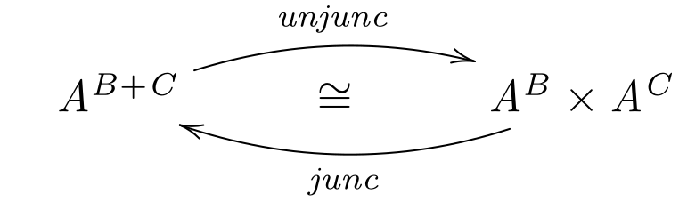
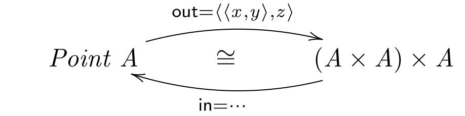

# CP - Ficha 5

## Exercício 1

> No cálculo de programas, as definições condicionais do tipo
>
> $$h \; x = \mathbf{if} \; p \; x \; \mathbf{then} \; f \; x \; \mathbf{else} \; g \; x \tag{F1}$$
>
> são escritas usando o combinador ternário
>
> $$p \rightarrow f , g$$
>
> conhecido pelo nome de *condicional de McCarthy*, cuja definição
>
> $$p \rightarrow f , g = [f , g ] \cdot p? \tag{F2}$$
>
> vem no [formulário](https://haslab.github.io/CP/Material/cpCalFun.pdf).
Baseie-se em leis desse [formulário](https://haslab.github.io/CP/Material/cpCalFun.pdf)
para demonstrar a chamada 2ª-lei de fusão do condicional:
>
> $$(p \rightarrow f , g) \cdot h = (p \cdot h) \rightarrow (f \cdot h), (g \cdot h)$$

### Resolução 1

$$
\begin{align*}
&(p \rightarrow f , g) \cdot h \\
&= \tag{\small{30: Cond. McCharty (F2), 2: Assoc-comp}} \\
&[f, g] \cdot (p? \cdot h) \\
&= \tag{\small{29: Natural-guarda}} \\
&[f, g] \cdot (h + h) \cdot (p \cdot h)? \\
&= \tag{\small{22: Absorção-+}} \\
&[f \cdot h, g \cdot h] \cdot (p \cdot h)? \\
&= \tag{\small{30: Cond. McCharty (F2)}} \\
&(p \cdot h) \rightarrow f \cdot h, g \cdot h
\end{align*}
$$

<div style="page-break-after: always;"></div>

## Exercício 2

> Numa máquina paralela pode fazer sentido, em (F1), não esperar por $p \; x$
para avaliar $f \; x$ ou $g \; x$, mas sim correr tudo em paralelo,
>
> $$parallel \; p \; f \; g = \langle\langle f , g \rangle, p \rangle$$
>
> e depois fazer a escolha do resultado:
>
> $$choose = \pi_2 \rightarrow \pi_1 \cdot \pi_1, \pi_2 \cdot \pi_1$$
>
> Mostre que, de facto:
>
> $$choose \cdot parallel \; p \; f \; g = p \rightarrow f , g$$

### Resolução 2

$$
\begin{align*}
&choose \cdot parallel \; p \; f \; g \\
&= \tag{\small{Def. $parallel$, Def. $choose$}} \\
&(\pi_2 \rightarrow \pi_1 \cdot \pi_1, \pi_2 \cdot \pi_1) \cdot \langle\langle f , g \rangle, p \rangle \\
&= \tag{\small{32: 2ª lei de fusão condicional}} \\
&\pi_2 \cdot \langle\langle f , g \rangle, p \rangle \rightarrow \pi_1 \cdot \pi_1 \cdot \langle\langle f , g \rangle, p \rangle, \pi_2 \cdot \pi_1 \cdot \langle\langle f , g \rangle, p \rangle \\
&= \tag{\small{7: Cancelamento-×}} \\
&p \rightarrow f , g
\end{align*}
$$

<div style="page-break-after: always;"></div>

## Exercício 3

> Sabendo que as igualdades
>
> $$
> \begin{align*}
> &p \rightarrow k, k = k \tag{F3} \\
> &(p? + p?) \cdot p? = (i_1 + i_2) \cdot p? \tag{F4}
> \end{align*}
> $$
>
> se verificam, demonstre as seguintes propriedades do mesmo combinador:
>
> $$
> \begin{align*}
> &\langle (p \rightarrow f , h), (p \rightarrow g , i) \rangle = p \rightarrow \langle f , g \rangle , \langle h , i \rangle \tag{F5} \\
> &\langle f , (p \rightarrow g , h) \rangle = p \rightarrow \langle f , g \rangle , \langle f , h \rangle \tag{F6} \\
> &p \rightarrow (p \rightarrow a , b), (p \rightarrow c , d) = p \rightarrow a , d \tag{F7}
> \end{align*}
> $$

### Resolução 3

$$
\text{(F5)} \\[1em]
$$

$$
\begin{align*}
&\langle (p \rightarrow f , h), (p \rightarrow g , i) \rangle \\
&= \tag{\small{30: Cond. McCharty}} \\
&\langle [f, h] \cdot p?, [g, i] \cdot p? \rangle \\
&= \tag{\small{9: Fusão-×}} \\
&\langle [f, h], [g, i] \rangle \cdot p? \\
&= \tag{\small{28: Lei da troca}} \\
&[\langle f, g \rangle, \langle h, i \rangle] \cdot p? \\
&= \tag{\small{30: Cond. McCharty}} \\
&p \rightarrow \langle f, g \rangle, \langle h, i \rangle
\end{align*}
$$


$$
\\[2em]
\text{(F6)} \\[1em]
$$

$$
\begin{align*}
&\langle f , (p \rightarrow g , h) \rangle \\
&= \tag{\small{F3}} \\
&\langle (p \rightarrow f, f), (p \rightarrow g , h) \rangle \\
&= \tag{\small{F5}} \\
&p \rightarrow \langle f, g \rangle, \langle f, h \rangle
\end{align*}
$$

<div style="page-break-after: always;"></div>

$$
\\[2em]
\text{(F7)} \\[1em]
$$

$$
\begin{align*}
&p \rightarrow (p \rightarrow a , b), (p \rightarrow c , d) \\
&= \tag{\small{30: Cond. McCharty (3×)}} \\
&[[a, b] \cdot p?, [c, d] \cdot p?] \cdot p? \\
&= \tag{\small{22: Absorção-+}} \\
&[[a, b], [c, d]] \cdot (p? \cdot p?) \cdot p? \\
&= \tag{\small{F4}} \\
&[[a, b], [c, d]] \cdot (i_1 + i_2) \cdot p? \\
&= \tag{\small{22: Absorção-+, 18: Cancelamento-+}} \\
&[a, d] \cdot p? \\
&= \tag{\small{30: Cond. McCharty}} \\
&p \rightarrow a, d
\end{align*}
$$

## Exercício 4

> Mostre que a propriedade de cancelamento da exponenciação
>
> $$\text{ap} \cdot (\overline{f} \times id) = f \tag{F8}$$
>
> corresponde à definição
>
> $$\text{curry} \; f \; a \; b = f \; (a , b)$$
>
> quando se escreve $\text{curry} \; f$ em lugar de $\overline{f}$.

### Resolução 4

$$
\begin{align*}
&\text{ap} \cdot (\overline{f} \times id) = f \\
&\equiv \tag{\small{72: Ig. Ext., 73: Def-comp}} \\
&\text{ap} \; ((\overline{f} \times id) \; (a,b)) = f \; (a,b) \\
&\equiv \tag{\small{78: Def-×}} \\
&\text{ap} \; (\overline{f} \; a, id) = f \; (a,b) \\
&\equiv \tag{\small{84: Def-ap, 1: Natural-id}} \\
&\overline{f} \; a \; b = f \; (a,b) \\
&\equiv \tag{\small{85: Curry, Def. $curry$}} \\
&curry \; f \; a \; b = f \; (a,b)
\end{align*}
$$

<div style="page-break-after: always;"></div>

## Exercício 5

> Mostre que a definição de $\text{uncurry}$ se pode obter também de (F8)
fazendo $f := \text{uncurry} \; g$, introduzindo variáveis e simplificando.

### Resolução 5

$$
\begin{align*}
&f := \text{uncurry} \; g = \widehat{g} \\
&\equiv \tag{\small{F8}} \\
&\text{ap} \cdot (\overline{\widehat{g}} \times id) = \widehat{g} \\
&\equiv \tag{\small{72: Ig. Ext., 73: Def-comp, Iso.: $\overline{\widehat{g}} = g$}} \\
&\text{ap} \; ((g \times id) \; (a,b)) = \widehat{g} \; (a,b) \\
&\equiv \tag{\small{78: Def-×, 1: Natural-id}} \\
&\text{ap} \; (g \; a, b) = \widehat{g} \; (a,b) \\
&\equiv \tag{\small{84: Def-ap, $\widehat{g} = \text{uncurry} \; g$}} \\
&g \; a \; b = \text{uncurry} \; g \; (a,b) \\
\end{align*}
$$

<div style="page-break-after: always;"></div>

## Exercício 6

> Prove a igualdade
>
> $$\overline{f \cdot (g \times h)} = \overline{\text{ap} \cdot (\text{id} \times h)} \cdot \overline{f} \cdot g \tag{F9}$$
>
> usando as leis das exponenciais e dos produtos.

### Resolução 6

$$
\begin{align*}
&\overline{f \cdot (g \times h)} = \overline{\text{ap} \cdot (\text{id} \times h)} \cdot \overline{f} \cdot g \\
&\equiv \tag{\small{35: Universal-exp}} \\
&f \cdot (g \times h) = \text{ap} \cdot ((\overline{\text{ap} \cdot (id \times h)} \cdot \overline{f} \cdot g) \times id) \\
&\equiv \tag{\small{38: Fusão-exp, 1: Natural-id}} \\
&f \cdot (g \times h) = \text{ap} \cdot ((\overline{\text{ap} \cdot (id \times h)} \cdot \overline{f \cdot (g \times id)}) \times (id \cdot id)) \\
&\equiv \tag{\small{2: Assoc-comp, 14: Functor-×}} \\
&f \cdot (g \times h) = \text{ap} \cdot ((\overline{\text{ap} \cdot (id \times h)} \times id) \cdot (\overline{f \cdot (g \times id)} \times id)) \\
&\equiv \tag{\small{36: Cancelamento-exp}} \\
&f \cdot (g \times h) = (\text{ap} \cdot (id \times h)) \cdot (\overline{f \cdot (g \times id)} \times id) \\
&\equiv \tag{\small{2: Assoc-comp, 14: Functor-×}} \\
&f \cdot (g \times h) = \text{ap} \cdot ((id \cdot \overline{f \cdot (g \times id)}) \times (h \cdot id)) \\
&\equiv \tag{\small{1: Natural-id (2×), 38: Fusão-exp}} \\
&f \cdot (g \times h) = \text{ap} \cdot ((\overline{f} \cdot g) \times (id \cdot h)) \\
&\equiv \tag{\small{14: Functor-×}} \\
&f \cdot (g \times h) = \text{ap} \cdot ((\overline{f} \times id) \cdot (g \times h)) \\
&\equiv \tag{\small{2: Assoc-comp, 36: Cancelamento-exp}} \\
&f \cdot (g \times h) = f \cdot (g \times h) \qquad \text{c.q.d.}
\end{align*}
$$

<div style="page-break-after: always;"></div>

### Resolução 6 (Alternativa)

$$
\begin{align*}
&\overline{f \cdot (g \times h)} \\
&= \tag{\small{F9}} \\
&\overline{\text{ap} \cdot (\text{id} \times h)} \cdot \overline{f} \cdot g \\
&= \tag{\small{38: Fusão-exp}} \\
&\overline{\text{ap} \cdot (\text{id} \times h) \cdot (\overline{f} \times id)} \cdot g \\
&= \tag{\small{2: Assoc-comp, 14: Functor-×}} \\
&\overline{\text{ap} \cdot ((\text{id} \cdot \overline{f}) \times (h \cdot id))} \cdot g \\
&= \tag{\small{1: Natural-id}} \\
&\overline{\text{ap} \cdot (\overline{f} \times h)} \cdot g \\
&= \tag{\small{38: Fusão-exp}} \\
&\overline{\text{ap} \cdot (\overline{f} \times h) \cdot (g \times id)} \\
&= \tag{\small{14: Functor-×, 1: Natural-id}} \\
&\overline{\text{ap} \cdot ((\overline{f} \cdot g) \times h)} \\
&= \tag{\small{38: Fusão-exp}} \\
&\overline{\text{ap} \cdot (\overline{f \cdot (g \times id)} \times h)} \\
&= \tag{\small{1: Natural-id (2×)}} \\
&\overline{\text{ap} \cdot ((\overline{f \cdot (g \times id)} \cdot id) \times (id \cdot h))} \\
&= \tag{\small{14: Functor-×}} \\
&\overline{\text{ap} \cdot ((\overline{f \cdot (g \times id)} \times id) \cdot (id \times h))} \\
&= \tag{\small{2: Assoc-comp, 36: Cancelamento-exp}} \\
&\overline{f \cdot (g \times id) \cdot (id \times h)} \\
&= \tag{\small{2: Assoc-comp, 14: Functor-×}} \\
&\overline{f \cdot ((g \cdot id) \times (id \cdot h))} \\
&= \tag{\small{1: Natural-id}} \\
&\overline{f \cdot (g \times h)} \\
\end{align*}
$$

<div style="page-break-after: always;"></div>

## Exercício 7

> É dada a definição
>
> $$\text{flip} \; f = \overline{\widehat{f} \cdot \text{swap}} \tag{F10}$$
>
> de acordo com:
>
> $$
> \begin{align*}
> &(C^B)^A \quad           \cong   \quad C^{A \times B} \quad                   \cong \quad C^{B \times A} \quad                                      \cong \hspace{1.2cm} (C^A)^B \\
> &\hspace{0.4cm} f \qquad \mapsto \quad \hspace{0.2cm} \widehat{f} \hspace{0.75cm} \mapsto \hspace{0.1cm} \widehat{f} \cdot \text{swap}\hspace{0.15cm} \mapsto \quad \overline{\widehat{f} \cdot \text{swap}} = \text{flip} \; f \\
> \end{align*}
> $$
>
> Mostre que $\text{flip}$ é um isomorfismo por ser a sua própria inversa:
>
> $$\text{flip} \; (\text{flip} \; f) = f \tag{F11}$$
>
> Mostre ainda que:
>
> $$\text{flip} \; f \; x \; y = f \; y \; x$$

### Resolução 7

$$
\begin{align*}
&\text{flip} \; (\text{flip} \; f) \\
&= \tag{\small{Def. $\text{flip}$ (2×)}} \\
&\overline{\widehat{\overline{\widehat{f} \cdot \text{swap}}} \cdot \text{swap}} \\
&= \tag{\small{Isomorfismo curry/uncurry}} \\
&\overline{\widehat{f} \cdot \text{swap} \cdot \text{swap}} \\
&= \tag{\small{$\text{swap} \cdot \text{swap} = id$, 1: Natural-id}} \\
&\overline{\widehat{f}} \\
&= \tag{\small{Isomorfismo curry/uncurry}} \\
&f \qquad \text{c.q.m.}
\end{align*}
$$

<div style="page-break-after: always;"></div>

## Exercício 8

> Mostre que
>
> $$junc \cdot unjunc = id \tag{F12}$$
> $$unjunc \cdot junc = id \tag{F13}$$
>
> se verificam, onde
>
> <div align="center">
>   
> </div>
>
> $$
> \begin{align*}
> \left\{
> \begin{aligned}
> &junc \; (f, g) = [f, g] \\
> &unjunc \; k = (k \cdot i_1, k \cdot i_2)
> \end{aligned}
> \right.
> \tag{F14}
> \end{align*}
> $$

### Resolução 8

$$
\begin{align*}
&junc \cdot unjunc = id \\
&\equiv \tag{\small{72: Ig. Ext., 73: Def-comp}} \\
&junc \; (unjunc \; k) = id \; k \\
&\equiv \tag{\small{Def. $unjunc$, 74: Def-id}} \\
&junc \; (k \cdot i_1, k \cdot i_2) = k \\
&\equiv \tag{\small{Def. $junc$}} \\
&[k \cdot i_1, k \cdot i_2] = k \\
&\equiv \tag{\small{20: Fusão-+, 19: Reflexão-+, 1: Natural-id}} \\
&k = k
\\[2em]
\end{align*}
$$

$$
\begin{align*}
&unjunc \cdot junc = id \\
&\equiv \tag{\small{72: Ig. Ext., 73: Def-comp, 74: Def-id}} \\
&unjunc \; (junc \; (f, g)) = (f, g) \\
&\equiv \tag{\small{Def. $junc$}} \\
&unjunc \; [f, g] = (f, g) \\
&\equiv \tag{\small{Def. $unjunc$}} \\
&(f \cdot i_1, g \cdot i_2) = (f, g) \\
&\equiv \tag{\small{18: Cancelamento-+}} \\
&(f, g) = (f, g)
\end{align*}
$$

<div style="page-break-after: always;"></div>

## Exercício 9

> Considere a seguinte sintaxe concreta em Haskell
para um tipo que descreve pontos no espaço tridimensional:
>
> ```haskell
> data Point a = Point {x :: a, y :: a, z :: a } deriving (Eq, Show)
> ```
>
> Pelo GHCi apura-se:
>
> ```haskell
> Point :: a -> a -> a -> Point a
> ```
>
> Raciocinando apenas em termos de tipos, conjecture a definição de $\text{in}$
na seguinte conversão dessa sintaxe concreta para abstracta:
>
> <div align="center">
>   
> </div>

### Resolução 9

$$
\begin{align*}
&\text{in} \cdot \langle x, \langle y, z \rangle \rangle = id \\
&\equiv \tag{\small{72: Ig. Ext., 74: Def-id}} \\
&\text{in} \cdot \langle x, \langle y, z \rangle \rangle \; (\text{Point} \; a \; b \; c) = \text{Point} \; a \; b \; c \\
&\equiv \tag{\small{$p = \text{Point} \; a \; b \; c$, 73: Def-comp, 77: Def-split (2×)}} \\
&\text{in} \; (x \; p, (y \; p, z \; p)) = p \\
&\equiv \tag{\small{Def. $x$, $y$ e $z$}} \\
&\text{in} \; (a, (b, c)) = \text{Point} \; a \; b \; c \\
&\equiv \tag{\small{86: Uncurry (2×)}} \\
&\text{in} \; (a, (b, c)) = \widehat{\widehat{\text{Point}}} \; ((a, b), c) \\
&\equiv \tag{\small{72: Ig. Ext.}} \\
&\text{in} = \widehat{\widehat{\text{Point}}}
\end{align*}
$$

<div style="page-break-after: always;"></div>

## Exercício 10

> **Questão prática**
>> ***Problem requirements**: The solution given for a previous problem,*
>>
>> $$store \; c = \text{take} \; 10 \cdot nub \cdot (c :)\tag{F15}$$
>>
>> *calls the standard function*
>>
>> ```haskell
>> nub :: (Eq a) => [a] -> [a]
>> ```
>>
>> *available from the [Data.List](https://hackage.haskell.org/package/base-4.18.0.0/docs/Data-List.html)
>library in Haskell.*
>>
>> *After inspecting the standard implementation of this function, define $f$ so that*
>>
>> $$\text{nub} = [nil, cons] \cdot f$$
>>
>> *is an alternative to the standard definition, where $nil \; \_ = [\;]$ and $cons \; (h,t) = h : t$.*
>>
>> *Check that $store \; c$ (F15) works properly once the standard $nub$ is replaced by yours.*
>>
>> ***Important**: Structure your solution across the
$f \cdot g$, $\langle f, g \rangle$, $f \times g$, $[f, g]$ and $f + g$
combinators that can be found in library [Cp.hs](https://haslab.github.io/CP/Material/).
Use **diagrams** to plan your proposed solution, which should
avoid re-inventing functions over lists already available in the Haskell
[standard libraries](https://hackage.haskell.org/).*

### Resolução 10

**TODO**

$\square$
