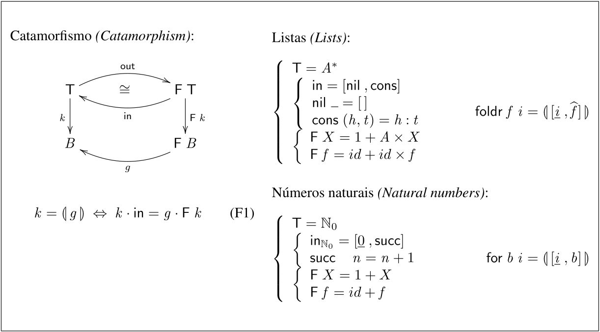
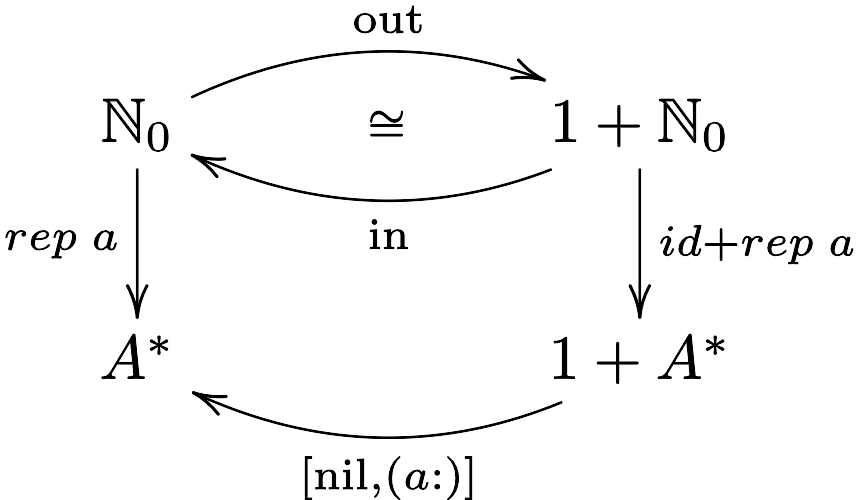
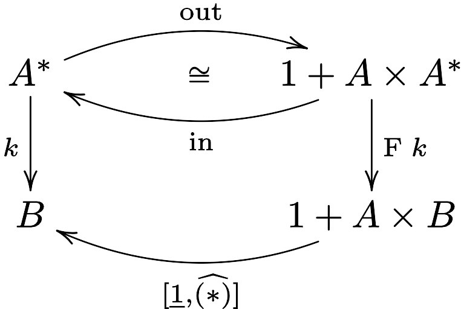
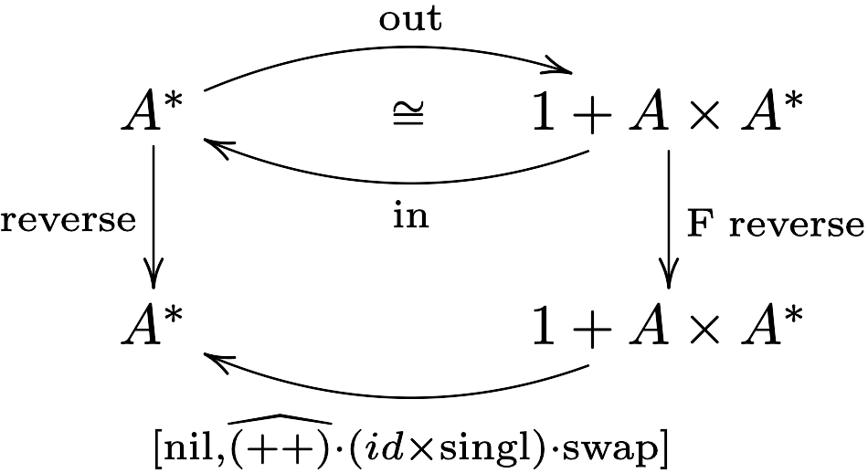
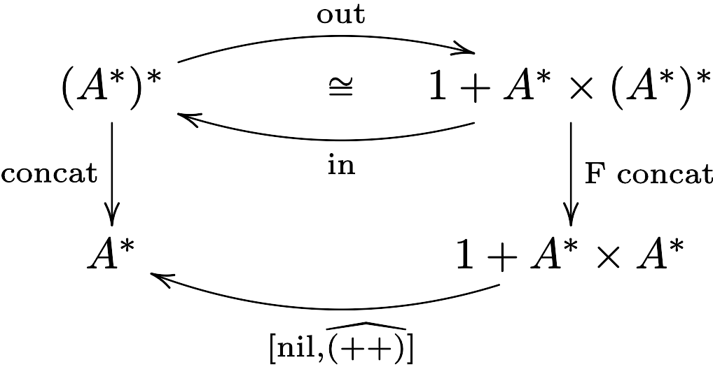
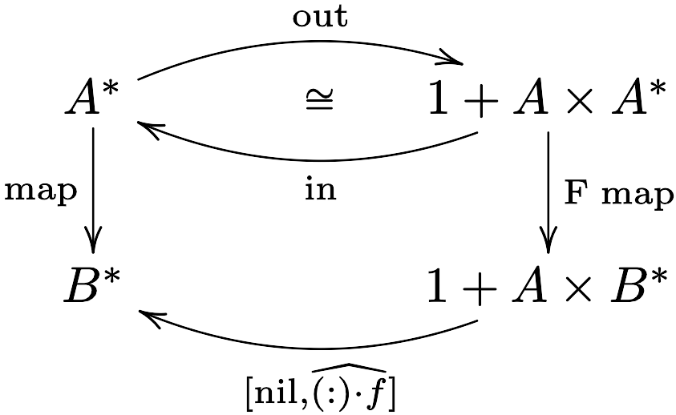
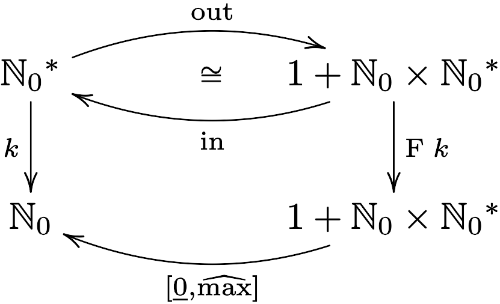
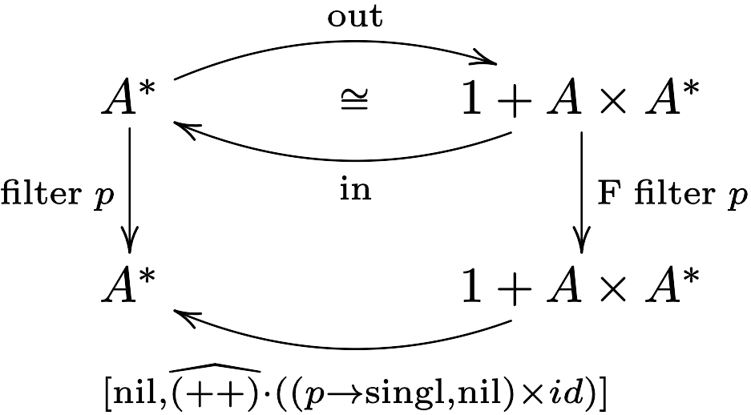
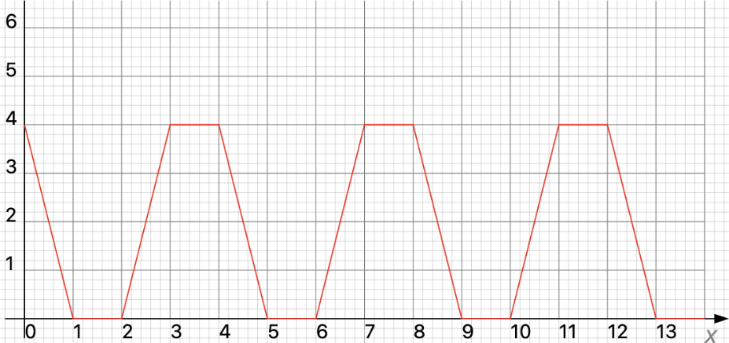

# CP - Ficha 7

> O quadro abaixo representa a **propriedade universal** que define o combinador
**catamorfismo**, com duas instâncias — números naturais $\mathbb{N}_0$ e listas
e listas finitas $A^*$ , onde $\widehat{f}$ abrevia $\text{uncurry} f$.

<div align="center">
    
</div>

## Exercício 1

> Fazendo $\text{T} = \mathbb{N}_0$, codifique — recorrendo à biblioteca
[Cp.hs](https://haslab.github.io/CP/Material/Cp.hs) e à definição
de $\text{out}$ feita numa ficha anterior — o combinador:
>
> $$
> \lb g \rb = g \cdot (id + \lb g \rb) \cdot \text{out} \tag{F2}
> $$
>
> De seguida implemente e teste a seguinte função:
>
> $$
> rep \; a = \lb [\text{nil} , (\text{$a$:})] \rb \tag{F3}
> $$
>
> O que faz ela?

<div style="page-break-after: always;"></div>

### Resolução 1

```haskell
{-# LANGUAGE NPlusKPatterns #-}

import Cp (i1, i2, (-|-), nil)

-- Definição de out para números naturais
out 0     = i1 ()
out (n+1) = i2 n

-- Definição de functor para números naturais
fF f = id -|- f

-- Definição do catamorfismo para números naturais
cata g = g . fF (cata g) . out

-- Definição de rep
rep a = cata (either nil (a:))
```

```haskell
-- Testes da função rep
ghci> rep "abc" 0
[]
ghci> rep "abc" 1
["abc"]
ghci> rep True 2
[True, True]
```

<div align="center">
    
</div>

$$
\begin{align*}
&rep : \text{A} \to \mathbb{N}_0 \to \text{A}^* \\
&rep \; a = \text{for} \; (\text{$a$:}) \; \text{[ ]}
\tag{\small{Def. for, Def. nil}}
\end{align*}
$$

A função $rep \; a \; n$ cria uma lista com $n$ elementos iguais a $a$.

<div style="page-break-after: always;"></div>

## Exercício 2

> Identifique como catamorfismos de listas ($k = \lb g \rb$) as funções seguintes,
indicando o gene $g$ para cada caso (apoie a sua resolução com diagramas):
>
> a) $k$ é a função que multiplica todos os elementos de uma lista.
>
> b) $k = \text{reverse}$
>
> c) $k = \text{concat}$
>
> d) $k$ é a função $\text{map} \; f$, para um dado $f: A \to B$.
>
> e) $k$ é a função que calcula o máximo de uma lista de números naturais $(\mathbb{N_0}^*)$.
>
> f) $k = \text{filter} \; p$ onde:
>
> ```haskell
> filter p [] = []
> filter p (h:t) = x ++ filter p t
>   where x = if (p h) then [h] else []
> ```

### Resolução 2

#### a)

<div>
    
</div>

#### b)

<div>
    
</div>

$$
\textbf{NB:}\quad
g_2 = \widehat{(++)} \cdot (id \times \text{singl}) \cdot \text{swap}
\quad\equiv\quad
g_2 \; (a,b) = b \text{ ++ } [a] \hspace{15em}
$$

<div style="page-break-after: always;"></div>

#### c)

<div>
    
</div>

#### d)

<div>
    
</div>

#### e)

<div>
    
</div>

#### f)

<div>
    
</div>

<div style="page-break-after: always;"></div>

## Exercício 3

> A função seguinte, em Haskell
>
> ```haskell
> sumprod a [] = 0
> sumprod a (h:t) = a * h + sumprod a t
> ```
>
> é o catamorfismo de listas
>
> $$
> \text{sumprod} \; a = \lb [\text{zero}, \text{add} \cdot ((a*) \times id)] \rb \tag{F4}
> $$
>
> onde $\text{zero} = \underline{0}$ e $\text{add} \; (x, y) = x + y$.
Como exemplo de aplicação da propriedade de **fusão-cata** para listas, demonstre a igualdade
>
> $$\text{sumprod} \; a = (a*) \cdot \text{sum} \tag{F5}$$
>
> onde $\text{sum} = \lb [\text{zero}, \text{add}] \rb$. \
**NB:** não ignore propriedades elementares da aritmética que lhe possam ser úteis.

$$
\begin{align*}\\[1.5em]
&\text{sumprod} \; a = \lb [\text{zero}, \text{add} \cdot ((a*) \times id)] \rb \\
&\equiv \tag{\small{Def. sum, F5}} \\
&(a*) \cdot \lb [\text{zero}, \text{add}] \rb = \lb [\text{zero}, \text{add} \cdot ((a*) \times id)] \rb \\
&\Leftarrow \tag{\small{49: Fusão-cata, $\text{F} \; (a*) = id + id \times (a*)$ }} \\
&(a*) \cdot [\text{zero}, \text{add}] = [\text{zero}, \text{add} \cdot ((a*) \times id)] \cdot (id + id \times (a*)) \\
&\equiv \tag{\small{20: Fusão-+, 22: Absorção-+, 27: Eq-x}} \\
&\left\{
\begin{aligned}
&(a*) \cdot \text{zero} = \text{zero} \cdot id \\
&(a*) \cdot \text{add} = \text{add} \cdot ((a*) \times id) \cdot (id \times (a*))
\end{aligned}
\right. \\
&\equiv \tag{\small{1: Natural-id, Def. zero, 72: Ig. Ext., 73: Def-comp, 75: Def. const}} \\
&\left\{
\begin{aligned}
&a * 0 = 0 \\
&a * (\text{add} \; (x,y)) = \text{add} \cdot ((a*) \times id) \cdot (id \times (a*)) \; (x,y) \\
\end{aligned}
\right. \\
&\equiv \tag{\small{Def. add (2×), 73: Def-comp, 78: Def-× (2×), 74: Def. id (2×)}} \\
&\left\{
\begin{aligned}
&a * 0 = 0 \\
&a * (x + y) = a * x + a * y \\
\end{aligned}
\right. \\
&\equiv \tag{\small{Elem. absorvente e distributividade da multiplicação}} \\
&\text{True}
\end{align*}
$$

<div style="page-break-after: always;"></div>

## Exercício 4

> A função $\text{foldr} \; \overline{\pi_2} \; i$ é necessariamente uma função constante.
Qual? Justifique com o respectivo cálculo.

$$
\begin{align*}
&\underline{k} = \text{foldr} \; \overline{\pi_2} \; i \\
&\equiv \tag{\small{Def. foldr}} \\
&\underline{k} = \lb [\underline{i}, \widehat{\overline{\pi_2}}] \rb \\
&\equiv \tag{\small{Iso. curry/uncurry, 46: Universal-cata}} \\
&\underline{k} \cdot \text{in} = [\underline{i}, \pi_2] \cdot (id + id \times \underline{k}) \\
&\equiv \tag{\small{Def. in, 20: Fusão-+, 22: Absorção-+}} \\
&[\underline{k} \cdot \text{nil}, \underline{k} \cdot \text{cons}] = [\underline{i} \cdot id, \pi_2 \cdot (id \times \underline{k})] \\
&\equiv \tag{\small{3: Fusão-const, 27: Eq-+}} \\
&\left\{
\begin{aligned}
&\underline{k} = \underline{i} \\
&\underline{k} = \pi_2 \cdot (id \times \underline{k}) \\
\end{aligned}
\right. \\
&\equiv \tag{\small{12: Natural-$\pi_2$, 3: Fusão-const}} \\
&\left\{
\begin{aligned}
&\underline{k} = \underline{i} \\
&\underline{k} = \underline{k} \\
\end{aligned}
\right. \\[2em]
&\text{Logo,} \quad \text{foldr} \; \overline{\pi_2} \; i = \underline{i}
\end{align*}
$$

<div style="page-break-after: always;"></div>

## Exercício 5

<blockquote>

A figura representa a função $\pi_1 \cdot aux$, para $aux$ definida ao lado:

<table style="border: 0px !important">
  <tr style="border: 0px !important">
    <td width="50%" style="border: 0px !important">
      
    </td>
    <td width="50%" style="border: 0px !important">
      <div style="margin: 25px 0">

```haskell
aux = for loop (4, −2)
  where loop (a, b) = (2 + b, 2 - a)
```

</div></td></tr></table>

Partindo da definição do combinador
$\text{for} \; b \; i = \lb [\underline{i}, b] \rb$,
para $\text{F} = id + f$ e $\text{in} = [\underline{0}, \text{succ}]$,
resolva em ordem a $f$ e $g$ a equação

$$\langle f , g \rangle = aux$$

por aplicação da lei de recursividade mútua,
entregando as definições de $f$ e $g$ em notação *pointwise*.

</blockquote>

$$
\begin{align*}\\[1.5em]
&\text{loop} \; (a, b) = (2 + b, 2 - a) \\
&\equiv \tag{\small{78: Def-×}} \\
&\text{loop} \; (a, b) = ((2+) \times (2-)) \; (b,a) \\
&\equiv \tag{\small{Def. pointwise swap, 72: Ig. Ext.}} \\
&\text{loop} = ((2+) \times (2-)) \cdot \text{swap} \\
&\equiv \tag{\small{Def. pointfree swap}} \\
&\text{loop} = ((2+) \times (2-)) \cdot \langle \pi_2, \pi_1 \rangle \\
&\equiv \tag{\small{11: Absorção-×}} \\
&\text{loop} = \langle (2+) \cdot \pi_2, (2-) \cdot \pi_1 \rangle \\[1em]
\end{align*}
$$

$$
\begin{align*}\\[1.5em]
&\langle f , g \rangle = aux \\
&\equiv \tag{\small{Def. $aux$}} \\
&\langle f , g \rangle = \text{for} \; \text{loop} \; (4, -2) \\
&\equiv \tag{\small{Def. for, Def. loop, $\underline{(a,b)} = \langle \underline{a}, \underline{b} \rangle$}} \\
&\langle f , g \rangle = \lb [\langle \underline{4}, \underline{-2} \rangle, \langle (2+) \cdot \pi_2, (2-) \cdot \pi_1 \rangle] \rb \\
&\equiv \tag{\small{28: Lei da troca}} \\
&\langle f , g \rangle = \lb \langle [\underline{4}, (2+) \cdot \pi_2], [\underline{-2}, (2-) \cdot \pi_1] \rangle \rb \\
&\equiv \tag{\small{53: Fokkinga, F $\langle f, g \rangle = id + \langle f, g \rangle$}} \\
&\left\{
\begin{aligned}
&f \cdot \text{in} = [\underline{4}, (2+) \cdot \pi_2] \cdot (id + \langle f, g \rangle) \\
&g \cdot \text{in} = [\underline{-2}, (2-) \cdot \pi_1] \cdot (id + \langle f, g \rangle)
\end{aligned}
\right. \\
&\equiv \tag{\small{$\text{in}_{\mathbb{N_0}} = [\underline{0}, \text{succ}]$, 20: Fusão-+ (2×), 22: Absorção-+ (2×)}} \\
&\left\{
\begin{aligned}
&[f \cdot \underline{0}, f \cdot \text{succ}] = [\underline{4}  \cdot id, (2+) \cdot \pi_2 \cdot \langle f, g \rangle] \\
&[g \cdot \underline{0}, g \cdot \text{succ}] = [\underline{-2} \cdot id, (2-) \cdot \pi_1 \cdot \langle f, g \rangle]
\end{aligned}
\right. \\
&\equiv \tag{\small{1: Natural-id (2×), 7: Cancelamento-× (2×), 27: Eq-+ (2×)}} \\
&\left\{
\begin{aligned}
&\left\{
\begin{aligned}
&f \cdot \underline{0} = \underline{4} \\
&f \cdot \text{succ} = (2+) \cdot g \\
\end{aligned}
\right. \\
&\left\{
\begin{aligned}
&g \cdot \underline{0} = \underline{-2} \\
&g \cdot \text{succ} = (2-) \cdot f \\
\end{aligned}
\right.
\end{aligned}
\right. \\
&\equiv \tag{\small{72: Ig. Ext., 73: Def-comp, Def. succ, 75: Def. const}} \\
&\left\{
\begin{aligned}
&\left\{
\begin{aligned}
&f \; 0 = 4 \\
&f \; (n+1) = 2 + g \; n \\
\end{aligned}
\right. \\
&\left\{
\begin{aligned}
&g \; 0 = -2 \\
&g \; (n+1) = 2 - f \; n \\
\end{aligned}
\right.
\end{aligned}
\right. \\
\end{align*}
$$

<div style="page-break-after: always;"></div>

## Exercício 6

> Mostre que a lei da recursividade mútua generaliza a mais do que duas funções, neste caso três:
>
> $$
> \left\{
> \begin{aligned}
> &f \cdot \text{in} = h \cdot \text{F} \; \langle\langle f, g\rangle, j\rangle \\
> &g \cdot \text{in} = k \cdot \text{F} \; \langle\langle f, g\rangle, j\rangle \\
> &j \cdot \text{in} = l \cdot \text{F} \; \langle\langle f, g\rangle, j\rangle
> \end{aligned}
> \right.
> \quad\equiv\quad \langle\langle f, g\rangle, j\rangle = \lb \langle\langle h, k\rangle, l\rangle \rb \tag{F6}$$

$$
\begin{align*}
&\left\{
\begin{aligned}
&f \cdot \text{in} = h \cdot \text{F} \; \langle\langle f, g\rangle, j\rangle \\
&g \cdot \text{in} = k \cdot \text{F} \; \langle\langle f, g\rangle, j\rangle \\
&j \cdot \text{in} = l \cdot \text{F} \; \langle\langle f, g\rangle, j\rangle
\end{aligned}
\right. \\
&\equiv \tag{\small{53: Fokkinga}} \\
&\left\{
\begin{aligned}
&\langle f, g \rangle = \lb \langle h, k \rangle \rb \\
&j \cdot \text{in} = l \cdot \text{F} \; \langle\langle f, g\rangle, j\rangle
\end{aligned}
\right. \\
&\equiv \tag{\small{46: Universal-cata}} \\
&\left\{
\begin{aligned}
&\langle f, g \rangle \cdot \text{in} = \langle h, k \rangle \cdot \text{F} \; \langle\langle f, g\rangle, j\rangle \\
&j \cdot \text{in} = l \cdot \text{F} \; \langle\langle f, g\rangle, j\rangle
\end{aligned}
\right. \\
&\equiv \tag{\small{53: Fokkinga}} \\
&\langle\langle f, g\rangle, j\rangle = \lb \langle\langle h, k\rangle, l\rangle \rb \quad\text{c.q.m.}
\end{align*}
$$

<div style="page-break-after: always;"></div>

## Exercício 7

> Considere o functor
>
> $$
> \left\{
> \begin{aligned}
> &\text{T} \; X = X \times X \\
> &\text{T} \; f = f \times f
> \tag{F7}
> \end{aligned}
> \right.
> $$
>
> e as funções
>
> $$\mu = \pi_1 \times \pi_2 \\
> u = \langle id, id \rangle\text{.}
> \tag{F8}$$
>
> a) Mostre que $\text{T}$ é de facto um functor:
>
> $$
> \begin{align*}
> &\text{T} \; id = id \\
> &\text{T} \; (f \cdot g) = \text{T} \; f \cdot \text{T} \; g
> \end{align*}
> $$
>
> b) Demonstre a propriedade:
>
> $$\mu \cdot \text{T} \; u = id = \mu \cdot u$$

### Resolução 7

#### a)

$$
\begin{align*}
&\text{T} \; id = id \\
&\equiv \tag{\small{F7}} \\
&\text{T} \; id = id \times id \\
&\equiv \tag{\small{15: Functor-id-×}} \\
&\text{True} \\[2em]
&\text{T} \; (f \cdot g) = \text{T} \; f \cdot \text{T} \; g \\
&\equiv \tag{\small{F7 (3×)}} \\
&(f \cdot g) \times (f \cdot g) = (f \times f) \cdot (g \times g) \\
&\equiv \tag{\small{14: Functor-×}} \\
&\text{True}
\end{align*}
$$

<div style="page-break-after: always;"></div>

#### b)

$$
\begin{align*}
&\mu \cdot \text{T} \; u = id \\
&\equiv \tag{\small{F7, F8}} \\
&(\pi_1 \times \pi_2) \cdot (\langle id, id \rangle \times \langle id, id \rangle) = id \\
&\equiv \tag{\small{14: Functor-×, 7: Cancelamento-× (2×)}} \\
&id \times id = id \\
&\equiv \tag{\small{15: Functor-id-×}} \\
&\text{True} \\[2em]
&\mu \cdot u = id \\
&\equiv \tag{\small{F8}} \\
&(\pi_1 \times \pi_2) \cdot \langle id, id \rangle = id \\
&\equiv \tag{\small{11: Absorção-×, 1: Natural-id (2×)}} \\
&\langle \pi_1, \pi_2 \rangle = id \\
&\equiv \tag{\small{8: Reflexão-×}} \\
&\text{True}
\end{align*}
$$

<div style="page-break-after: always;"></div>

## Exercício 8

> ***Problem requirements***:
>
> *In the context of a sporting competition (e.g. football league), suppose you have access to the history of all games of the competition, organized by date, in `db1 :: [(Date, [Game])]` (using Haskell syntax). Also given is `db2 :: [(Game, [Player])]` indicating which players played in which game.*
>
> *A sport-tv commentator asks you to derive from `db1` and from `db2` the list, ordered by player name, of the dates on which each player played, also ordered. Define, in Haskell, a function `f` implementing such a derivation:*
>
> ```haskell
> f :: [(Date, [Game])] -> [(Game, [Player])] -> [(Player, [Date])]
> ```
>
> *Challenged by these requirements, ChatGPT gave the solution given below in the black text boxes, which doesn’t type but is the sort of solution to be expected.
> In the context of this course, you can write **far less** code to implement `f`!*
>
> *Why and how?*
>
>
> ```haskell
> import Data.List (sort, nub)
>
> type Date = String -- You can replace String with an appropriate Date type
> type Player = String
> type Game = String
>
> -- Helper function to extract unique player names from a list of games
> extractPlayers :: [(Game, [Player])] -> [Player]
> extractPlayers = nub . concatMap snd
>
> -- Helper function to map players to the dates they played on
> mapPlayersToDates :: [(Date, [Game])] -> [(Game, [Player])] -> [(Player, [Date])]
> mapPlayersToDates db1 db2 = [(player, sort $ nub playedDates)]
>   where
>     players = extractPlayers db2
>     playedDates player = [date | (date, games) <- db1,
>                                  any (\(game, players) -> player `elem` players && game `elem` games) db2]
>
> -- Main function f
> f :: [(Date, [Game])] -> [(Game, [Player])] -> [(Player, [Date])]
> f db1 db2 = mapPlayersToDates db1 db2
> ```
>
> <div style="page-break-after: always;"></div>
>
> ```haskell
> -- Example usage:
> main :: IO ()
> main = do
>   let db1 = [("2023-10-01", ["Game1","Game2"]),
>              ("2023-10-02", ["Game2","Game3"])]
>
>   let db2 = [("Game1", ["PlayerA","PlayerB"]),
>              ("Game2", ["PlayerA","PlayerC"]),
>              ("Game3", ["PlayerB","PlayerC"])]
>
>   let result = f db1 db2
>   print result
> ```

$\square$
